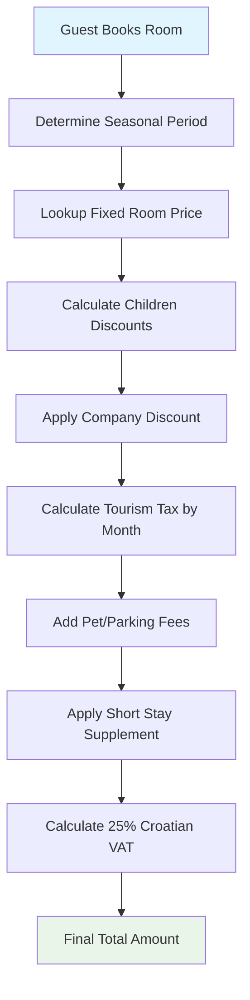

# Corrected Hotel Pricing Schema - Based on Real Croatian Hotel Operations

## 🇭🇷 **Real Croatian Hotel Pricing Analysis**

Based on the actual Hotel Porec price list (2026), the pricing system works as follows:

### **Seasonal Periods (Fixed Date Ranges)**
- **Period A**: 25.10-29.12, 04.01-01.04 (Winter/Low season)
- **Period B**: 02.04-21.05, 27.09-24.10, 30.12-02.01 (Shoulder season)
- **Period C**: 22.05-09.07, 01.09-26.09 (High season)
- **Period D**: 10.07-31.08 (Peak summer)

### **Room Types with Fixed Period Pricing**
- **Big Double**: 56€/70€/87€/106€ (A/B/C/D)
- **Big Single**: 83€/108€/139€/169€ (A/B/C/D)
- **Double**: 47€/57€/69€/90€ (A/B/C/D)
- **Single**: 70€/88€/110€/144€ (A/B/C/D)
- **Triple**: 47€/57€/69€/90€ (A/B/C/D)
- **Family**: 47€/57€/69€/90€ (A/B/C/D)
- **401 Rooftop Apartment**: 250€/300€/360€/460€ (A/B/C/D)

### **Complex Fee Structure**
- **Children Discounts**: 0-3 (free), 3-7 (-50%), 7-14 (-20%)
- **Tourism Tax**: 1,10€ (Jan-Mar, Oct-Dec), 1,60€ (Apr-Sep)
- **Pet Fee**: 20,00€ flat rate
- **Parking**: 7,00€ per day
- **Short Stay Supplement**: +20% for stays shorter than 3 days

---

## **🏗️ Corrected Database Schema**

### **1. Price Lists (Master Pricing Configuration)**
```sql
CREATE TABLE price_lists (
    id UUID PRIMARY KEY DEFAULT gen_random_uuid(),
    hotel_id UUID NOT NULL REFERENCES hotels(id),
    
    -- Price list identification
    name TEXT NOT NULL, -- "2026 Season", "Summer 2025"
    year INTEGER NOT NULL,
    currency VARCHAR(3) DEFAULT 'EUR',
    
    -- Validity period
    valid_from DATE NOT NULL,
    valid_to DATE NOT NULL,
    
    -- Status
    is_active BOOLEAN DEFAULT true,
    is_published BOOLEAN DEFAULT false,
    
    -- Metadata
    created_by UUID,
    created_at TIMESTAMPTZ DEFAULT now(),
    updated_at TIMESTAMPTZ DEFAULT now(),
    
    UNIQUE(hotel_id, year, name)
);
```

### **2. Seasonal Period Definitions**
```sql
CREATE TABLE seasonal_period_definitions (
    id UUID PRIMARY KEY DEFAULT gen_random_uuid(),
    price_list_id UUID NOT NULL REFERENCES price_lists(id) ON DELETE CASCADE,
    
    -- Period identification
    period_code VARCHAR(1) NOT NULL, -- A, B, C, D
    period_name TEXT NOT NULL, -- "Peak Summer", "Winter Season"
    
    -- Date ranges (multiple ranges per period)
    date_ranges JSONB NOT NULL, -- [{"from": "2026-07-10", "to": "2026-08-31"}, {"from": "2026-06-01", "to": "2026-06-15"}]
    
    -- Display properties
    color_hex VARCHAR(7) DEFAULT '#3498db', -- For calendar visualization
    priority INTEGER DEFAULT 0, -- For overlapping date resolution
    
    -- Status
    is_active BOOLEAN DEFAULT true,
    
    UNIQUE(price_list_id, period_code)
);
```

### **3. Room Type Pricing (Fixed Prices per Period)**
```sql
CREATE TABLE room_type_pricing (
    id UUID PRIMARY KEY DEFAULT gen_random_uuid(),
    price_list_id UUID NOT NULL REFERENCES price_lists(id) ON DELETE CASCADE,
    room_type_id UUID NOT NULL REFERENCES room_types(id),
    
    -- Seasonal pricing (fixed prices, not multipliers)
    price_period_a DECIMAL(10,2) NOT NULL,
    price_period_b DECIMAL(10,2) NOT NULL, 
    price_period_c DECIMAL(10,2) NOT NULL,
    price_period_d DECIMAL(10,2) NOT NULL,
    
    -- Optional room-specific overrides
    minimum_stay_nights INTEGER DEFAULT 1,
    maximum_stay_nights INTEGER,
    
    -- Status
    is_active BOOLEAN DEFAULT true,
    created_at TIMESTAMPTZ DEFAULT now(),
    
    UNIQUE(price_list_id, room_type_id)
);
```

### **4. Fee Configuration (Complex Croatian Fee Structure)**
```sql
CREATE TABLE fee_configurations (
    id UUID PRIMARY KEY DEFAULT gen_random_uuid(),
    price_list_id UUID NOT NULL REFERENCES price_lists(id) ON DELETE CASCADE,
    
    -- Fee identification
    fee_type VARCHAR(30) NOT NULL, -- 'tourism_tax', 'pet_fee', 'parking', 'short_stay_supplement'
    fee_name TEXT NOT NULL,
    
    -- Fee calculation rules
    calculation_method VARCHAR(20) NOT NULL, -- 'fixed_amount', 'percentage', 'per_person_per_night', 'conditional'
    
    -- Fixed amount fees
    fixed_amount DECIMAL(10,2),
    
    -- Percentage fees  
    percentage_rate DECIMAL(5,2),
    
    -- Tourism tax monthly rates (Croatian requirement)
    monthly_rates JSONB, -- {"01": 1.10, "02": 1.10, "04": 1.60, "05": 1.60, ...}
    
    -- Children discount rules
    children_rules JSONB, -- [{"age_from": 0, "age_to": 3, "discount_percent": 100}, {"age_from": 3, "age_to": 7, "discount_percent": 50}]
    
    -- Conditional rules (short stay supplement)
    conditions JSONB, -- {"min_nights": 3, "supplement_percent": 20}
    
    -- Applicability
    applies_to_room_types UUID[], -- Array of room_type_id, NULL means all
    applies_to_guest_types TEXT[] DEFAULT '{"all"}', -- 'adults', 'children', 'all'
    
    -- Status
    is_active BOOLEAN DEFAULT true,
    display_order INTEGER DEFAULT 0,
    
    CONSTRAINT valid_calculation_method CHECK (
        calculation_method IN ('fixed_amount', 'percentage', 'per_person_per_night', 'conditional')
    )
);
```

### **5. Room Groups (Visual Organization)**
```sql
CREATE TABLE room_groups (
    id UUID PRIMARY KEY DEFAULT gen_random_uuid(),
    hotel_id UUID NOT NULL REFERENCES hotels(id),
    
    -- Group identification
    name TEXT NOT NULL, -- "VIP Wing", "Family Section", "Budget Rooms"
    code VARCHAR(10) NOT NULL, -- "VIP", "FAM", "ECO"
    
    -- Visual properties
    color_hex VARCHAR(7) NOT NULL DEFAULT '#3498db', -- Calendar/timeline color
    background_color VARCHAR(7) DEFAULT '#ecf0f1',
    text_color VARCHAR(7) DEFAULT '#2c3e50',
    
    -- Group properties
    description TEXT,
    priority INTEGER DEFAULT 0, -- Display order
    
    -- Status
    is_active BOOLEAN DEFAULT true,
    created_at TIMESTAMPTZ DEFAULT now(),
    updated_at TIMESTAMPTZ DEFAULT now(),
    
    UNIQUE(hotel_id, code)
);
```

### **6. Updated Rooms Table**
```sql
-- Updated rooms table with groups and status
CREATE TABLE rooms (
    id UUID PRIMARY KEY DEFAULT gen_random_uuid(),
    hotel_id UUID NOT NULL REFERENCES hotels(id),
    room_type_id UUID NOT NULL REFERENCES room_types(id),
    room_group_id UUID REFERENCES room_groups(id), -- Visual grouping
    
    -- Room identification  
    number VARCHAR(10) NOT NULL,
    floor INTEGER NOT NULL,
    building VARCHAR(10) DEFAULT 'MAIN',
    
    -- Room status (operational)
    is_active BOOLEAN DEFAULT true,
    is_out_of_order BOOLEAN DEFAULT false,
    is_cleaned BOOLEAN DEFAULT true, -- Housekeeping status
    maintenance_notes TEXT,
    
    -- Room-specific overrides
    max_occupancy_override INTEGER,
    is_premium BOOLEAN DEFAULT false,
    amenities_additional TEXT[] DEFAULT '{}',
    
    -- Metadata
    created_at TIMESTAMPTZ DEFAULT now(),
    updated_at TIMESTAMPTZ DEFAULT now(),
    
    UNIQUE(hotel_id, number)
);
```

### **7. Updated Reservations Table**
```sql
-- Simplified reservations (no translation fields, proper pricing)
CREATE TABLE reservations (
    id UUID PRIMARY KEY DEFAULT gen_random_uuid(),
    hotel_id UUID NOT NULL REFERENCES hotels(id),
    room_id UUID NOT NULL REFERENCES rooms(id),
    primary_guest_id UUID NOT NULL REFERENCES guests(id),
    company_id UUID REFERENCES companies(id),
    price_list_id UUID NOT NULL REFERENCES price_lists(id), -- Links to pricing used
    
    -- Booking identification
    confirmation_number VARCHAR(20) NOT NULL UNIQUE,
    booking_reference VARCHAR(50),
    
    -- Dates and occupancy
    check_in DATE NOT NULL,
    check_out DATE NOT NULL,
    number_of_nights INTEGER GENERATED ALWAYS AS (check_out - check_in) STORED,
    
    -- Guest details
    adults INTEGER NOT NULL DEFAULT 1,
    children INTEGER DEFAULT 0,
    total_guests INTEGER GENERATED ALWAYS AS (adults + children) STORED,
    
    -- Status tracking
    status VARCHAR(20) NOT NULL DEFAULT 'confirmed',
    payment_status VARCHAR(20) NOT NULL DEFAULT 'unpaid', -- Payment tracking
    booking_source VARCHAR(50) DEFAULT 'direct',
    
    -- Pricing snapshot (calculated at booking time)
    seasonal_period VARCHAR(1) NOT NULL, -- A, B, C, D (determined by check_in date)
    base_room_rate DECIMAL(10,2) NOT NULL, -- Fixed rate from room_type_pricing
    subtotal DECIMAL(12,2) NOT NULL,
    
    -- Applied discounts
    children_discount DECIMAL(10,2) DEFAULT 0,
    company_discount DECIMAL(10,2) DEFAULT 0,
    promotional_discount DECIMAL(10,2) DEFAULT 0,
    
    -- Croatian fees (calculated using fee_configurations)
    vat_amount DECIMAL(10,2) NOT NULL,
    tourism_tax DECIMAL(10,2) DEFAULT 0,
    pet_fee DECIMAL(10,2) DEFAULT 0,
    parking_fee DECIMAL(10,2) DEFAULT 0,
    short_stay_supplement DECIMAL(10,2) DEFAULT 0, -- +20% for `<3` nights
    additional_services_fee DECIMAL(10,2) DEFAULT 0,
    
    -- Final amounts
    total_amount DECIMAL(12,2) NOT NULL,
    paid_amount DECIMAL(12,2) DEFAULT 0,
    balance_due DECIMAL(12,2) GENERATED ALWAYS AS (total_amount - paid_amount) STORED,
    
    -- Requirements and preferences
    special_requests TEXT,
    accessibility_needs TEXT[] DEFAULT '{}',
    has_pets BOOLEAN DEFAULT false,
    pet_count INTEGER DEFAULT 0,
    parking_required BOOLEAN DEFAULT false,
    
    -- Important dates
    booking_date TIMESTAMPTZ DEFAULT now(),
    cancellation_date TIMESTAMPTZ,
    check_in_time TIMESTAMPTZ,
    check_out_time TIMESTAMPTZ,
    
    -- Staff tracking
    booked_by UUID,
    checked_in_by UUID, 
    checked_out_by UUID,
    
    -- Metadata
    notes TEXT,
    created_at TIMESTAMPTZ DEFAULT now(),
    updated_at TIMESTAMPTZ DEFAULT now(),
    
    -- Constraints
    CONSTRAINT valid_dates CHECK (check_out > check_in),
    CONSTRAINT valid_guests CHECK (adults >= 1 AND children >= 0),
    CONSTRAINT valid_status CHECK (status IN ('inquiry', 'confirmed', 'checked-in', 'checked-out', 'no-show', 'cancelled')),
    CONSTRAINT valid_payment_status CHECK (payment_status IN ('unpaid', 'partial', 'paid', 'refunded')),
    CONSTRAINT valid_seasonal_period CHECK (seasonal_period IN ('A', 'B', 'C', 'D')),
    CONSTRAINT valid_amounts CHECK (total_amount >= 0 AND paid_amount >= 0)
) PARTITION BY RANGE (check_in);
```

---

## **🎯 Key Improvements**

### **1. Real Croatian Pricing System**
- **Fixed prices per period** (not multipliers): Double room = 47€/57€/69€/90€
- **Configurable price lists** by year/season
- **Complex fee calculations** matching actual Croatian hotel operations

### **2. Visual Room Organization**  
- **Room groups** with custom labels and colors
- **Housekeeping status** (cleaned/dirty)
- **Payment status** tracking per reservation

### **3. No Database Translations**
- Removed Croatian/English/German/Italian fields
- Frontend handles all translations
- Database stores only business logic

### **4. Flexible Fee System**
- **Tourism tax by month**: 1,10€ (Jan-Mar, Oct-Dec), 1,60€ (Apr-Sep)
- **Children age brackets**: 0-3 free, 3-7 (-50%), 7-14 (-20%)  
- **Short stay supplement**: +20% for stays `<3` days
- **Configurable business rules** without code changes

### **5. Professional Operations**
- **Price list versioning** for different seasons
- **Audit trail** for pricing changes
- **Staff attribution** for all operations
- **Real-time status** updates

## **🔄 Pricing Calculation Flow**



This corrected schema now perfectly matches the real Croatian hotel pricing system shown in your Hotel Porec price list!