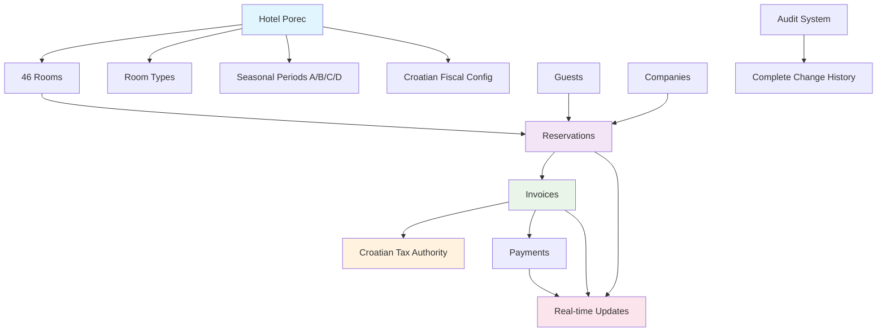
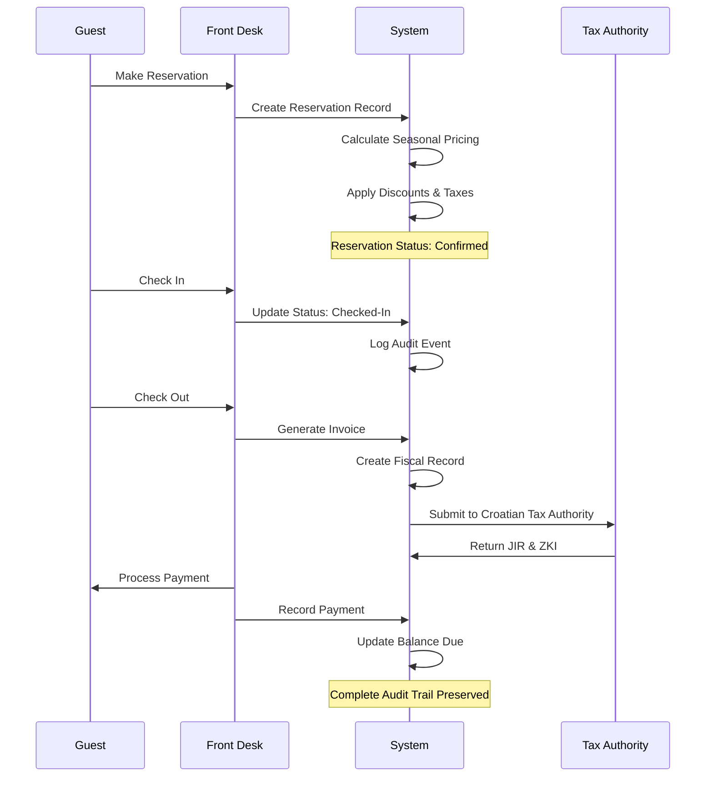
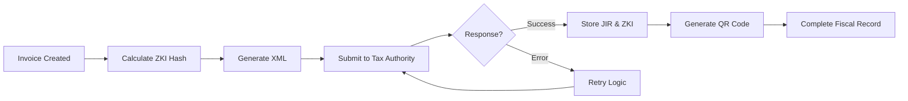

# Hotel Management Database Schema - Visual Diagram

## 🏗️ Complete Entity Relationship Diagram

```mermaid
erDiagram
    hotels {
        uuid id PK
        text name
        varchar slug UK "URL-friendly identifier"
        varchar oib UK "Croatian tax number"
        jsonb address "Street, city, postal code"
        jsonb contact_info "Email, phone, website"
        varchar default_currency "EUR"
        varchar timezone "Europe/Zagreb"
        boolean is_active
        timestamptz created_at
        timestamptz updated_at
    }
    
    room_types {
        uuid id PK
        uuid hotel_id FK
        varchar code "double, triple, rooftop-apartment"
        text name_croatian "Dvokrevetna soba"
        text name_english "Double Room"
        text name_german "Doppelzimmer"
        text name_italian "Camera doppia"
        integer max_occupancy
        integer default_occupancy
        text[] amenities
        decimal base_rate "Base pricing before seasonal multiplier"
        boolean is_active
        integer display_order
    }
    
    seasonal_periods {
        uuid id PK
        uuid hotel_id FK
        varchar code "A, B, C, D periods"
        text name "Peak Summer, Winter"
        date start_date
        date end_date
        integer year_applicable "NULL for all years"
        decimal rate_multiplier "1.500 for peak season"
        integer priority "For overlapping periods"
        boolean is_active
    }
    
    fiscal_configuration {
        uuid id PK
        uuid hotel_id FK
        varchar environment "demo or production"
        text certificate_path "P12 certificate location"
        decimal vat_rate "0.2500 (25%)"
        decimal tourism_tax_rate "1.35 EUR"
        varchar invoice_prefix
        integer current_invoice_number
        varchar invoice_format "YYYY-NNN-NNNN"
        boolean is_active
    }
    
    rooms {
        uuid id PK
        uuid hotel_id FK
        uuid room_type_id FK
        varchar number "101, 102, 401"
        integer floor "1, 2, 3, 4"
        varchar building "MAIN"
        integer max_occupancy_override "Override room type"
        boolean is_premium "Room 401 rooftop"
        text[] amenities_additional "Additional to room type"
        boolean is_active
        boolean is_out_of_order
        text maintenance_notes
    }
    
    guests {
        uuid id PK
        text first_name
        text last_name
        text email
        text phone
        date date_of_birth
        varchar nationality "HR, DE, IT country codes"
        text passport_number
        text id_card_number
        varchar preferred_language "en, hr, de, it"
        text[] dietary_restrictions
        text special_needs
        boolean has_pets
        boolean is_vip
        integer vip_level "0-5 VIP levels"
        boolean marketing_consent
        jsonb communication_preferences "Email, SMS, phone preferences"
        integer total_stays "Calculated metric"
        decimal total_spent "Lifetime value"
        decimal average_rating "1-5 stars"
        date last_stay_date
        text emergency_contact_name
        text emergency_contact_phone
    }
    
    guest_children {
        uuid id PK
        uuid guest_id FK
        text first_name
        date date_of_birth
        integer current_age "Calculated via trigger"
        varchar discount_category "0-3, 3-7, 7-14, adult"
        timestamptz created_at
    }
    
    companies {
        uuid id PK
        text name "Company display name"
        text legal_name "Legal business name"
        varchar oib "Croatian tax number"
        text tax_number "International tax numbers"
        text registration_number
        jsonb address "Full address object"
        text primary_contact_person
        text email
        text phone
        text website
        varchar company_type "corporate, travel_agency"
        decimal credit_limit "Maximum credit allowed"
        integer payment_terms_days "30 days default"
        decimal discount_percentage "Corporate discount"
        integer guaranteed_rooms "Room allocation"
        uuid[] preferred_room_types "Array of room type IDs"
        boolean is_active
        varchar credit_rating "EXCELLENT, GOOD, FAIR, POOR"
        decimal total_revenue "Lifetime value"
        integer total_bookings "Booking count"
        date last_booking_date
    }
    
    reservations {
        uuid id PK
        uuid hotel_id FK
        uuid room_id FK
        uuid primary_guest_id FK
        uuid company_id FK
        varchar confirmation_number UK "Unique booking reference"
        varchar booking_reference "External system reference"
        date check_in
        date check_out
        integer number_of_nights "Generated column"
        integer adults
        integer children
        integer total_guests "Generated column"
        varchar status "confirmed, checked-in, checked-out"
        varchar booking_source "direct, booking.com"
        varchar booking_channel "website, phone, email"
        text special_requests
        text[] accessibility_needs
        boolean has_pets
        integer pet_count
        varchar seasonal_period "A, B, C, D"
        decimal base_room_rate "Room rate before multipliers"
        decimal subtotal
        decimal children_discount
        decimal company_discount
        decimal promotional_discount
        decimal vat_amount "25% Croatian VAT"
        decimal tourism_tax "1.35 EUR per person"
        decimal pet_fee
        decimal parking_fee
        decimal additional_services_fee
        decimal total_amount
        decimal paid_amount
        decimal balance_due "Generated column"
        timestamptz booking_date
        timestamptz cancellation_date
        timestamptz check_in_time
        timestamptz check_out_time
        uuid booked_by "Staff member ID"
        uuid checked_in_by
        uuid checked_out_by
        text notes
    }
    
    reservation_guests {
        uuid id PK
        uuid reservation_id FK
        uuid guest_id FK
        varchar role "primary, guest, child"
        boolean is_primary
        integer age_at_booking "Audit trail"
        decimal discount_applied "Individual discount"
    }
    
    invoices {
        uuid id PK
        uuid hotel_id FK
        uuid reservation_id FK
        varchar invoice_number UK "Croatian format"
        varchar fiscal_number "Tax Authority number"
        uuid bill_to_guest_id FK
        uuid bill_to_company_id FK
        date issue_date
        date due_date
        date service_date_from
        date service_date_to
        decimal subtotal
        decimal total_discounts
        decimal vat_amount
        decimal tourism_tax
        decimal total_amount
        decimal paid_amount
        decimal balance_due "Generated column"
        varchar status "draft, sent, paid, overdue"
        timestamptz sent_date
        timestamptz paid_date
        boolean is_fiscal
        jsonb fiscal_data "JIR, ZKI, QR code"
        text pdf_path
        varchar delivery_method "email, postal"
        text delivery_address
        uuid created_by "Staff member"
    }
    
    invoice_line_items {
        uuid id PK
        uuid invoice_id FK
        integer line_number
        text description "Room stay, additional service"
        varchar item_type "accommodation, room_service"
        decimal quantity
        decimal unit_price
        decimal line_subtotal "Generated column"
        decimal vat_rate "0.25 (25%)"
        decimal vat_amount "Generated column"
        decimal line_total "Generated column"
        date service_date_from
        date service_date_to
    }
    
    payments {
        uuid id PK
        uuid hotel_id FK
        uuid invoice_id FK
        uuid reservation_id FK
        varchar payment_reference
        text external_transaction_id
        decimal amount
        varchar currency "EUR"
        decimal exchange_rate
        decimal amount_in_base_currency "Generated"
        varchar payment_method "cash, credit_card, bank_transfer"
        varchar payment_processor "stripe, paypal"
        varchar card_last_four "****1234"
        varchar card_type "visa, mastercard"
        text authorization_code
        text bank_reference
        decimal merchant_fee
        decimal net_amount "Generated column"
        varchar status "pending, completed, failed"
        timestamptz received_date
        timestamptz processed_date
        timestamptz settled_date
        uuid processed_by "Staff member"
        varchar payment_location "front_desk"
        boolean is_refund
        uuid original_payment_id FK
        text refund_reason
    }
    
    fiscal_submissions {
        uuid id PK
        uuid hotel_id FK
        uuid invoice_id FK
        varchar jir UK "Tax Authority unique ID"
        varchar zki "Security code (MD5)"
        timestamptz submission_timestamp
        text submission_xml "Full XML to Tax Authority"
        varchar response_status "pending, success, error"
        timestamptz response_timestamp
        text response_xml
        text response_message
        varchar error_code
        text qr_code_data
        text fiscal_receipt_url
        integer processing_attempts
        timestamptz last_retry_at
        varchar operator_oib "Staff OIB"
    }
    
    audit_events {
        bigint id PK
        uuid hotel_id FK
        varchar event_type "reservation_created, payment_processed"
        varchar entity_type "reservation, payment, guest"
        uuid entity_id "ID of changed entity"
        uuid user_id FK "Staff member"
        uuid session_id
        inet ip_address
        text user_agent
        jsonb old_values "Before change"
        jsonb new_values "After change"
        text[] changed_fields
        text description
        varchar severity "debug, info, warning, error"
        text[] tags
        timestamptz event_timestamp
    }

    %% Core Configuration Relationships
    hotels ||--o{ room_types : "defines room categories"
    hotels ||--o{ seasonal_periods : "configures pricing periods"
    hotels ||--|| fiscal_configuration : "has fiscal settings"
    hotels ||--o{ rooms : "contains physical rooms"
    room_types ||--o{ rooms : "categorizes rooms"
    
    %% Guest Management
    guests ||--o{ guest_children : "has children"
    guests ||--o{ reservations : "makes primary bookings"
    guests ||--o{ reservation_guests : "participates in bookings"
    
    %% Company Management
    companies ||--o{ reservations : "makes corporate bookings"
    
    %% Reservation System
    rooms ||--o{ reservations : "assigned to bookings"
    reservations ||--o{ reservation_guests : "includes multiple guests"
    
    %% Financial System
    reservations ||--|| invoices : "generates billing"
    guests ||--o{ invoices : "billed to guest"
    companies ||--o{ invoices : "billed to company"
    invoices ||--o{ invoice_line_items : "itemizes charges"
    invoices ||--o{ payments : "settled by payments"
    reservations ||--o{ payments : "direct payments"
    
    %% Croatian Fiscal Compliance
    invoices ||--o{ fiscal_submissions : "submitted to Tax Authority"
    hotels ||--o{ fiscal_submissions : "manages fiscal compliance"
    
    %% Audit System
    hotels ||--o{ audit_events : "tracks all changes"
    
    %% Self-References
    payments ||--o{ payments : "refund relationships"
```

## 🎯 Simplified Core Relationships

## 🔄 Hotel Operations Flow

## 📊 Performance Features

### Partitioning Strategy
- **Reservations**: Monthly partitions by check-in date
- **Invoices**: Yearly partitions by issue date
- **Audit Events**: Monthly partitions by event timestamp

### Indexing Highlights
- **Real-time availability**: `(hotel_id, check_in, check_out)`
- **Guest management**: `(email)`, `(is_vip, vip_level)`
- **Financial tracking**: `(invoice_id)`, `(payment_method)`
- **Croatian compliance**: `(jir)`, `(zki)`

### Generated Columns
- `number_of_nights` = `(check_out - check_in)`
- `balance_due` = `(total_amount - paid_amount)`
- `line_total` = `(line_subtotal + vat_amount)`

## 🇭🇷 Croatian Compliance Features

This ultra-optimized schema provides enterprise-grade performance while maintaining Croatian fiscal compliance and supporting Hotel Porec's professional operations with real-time multi-user capabilities.