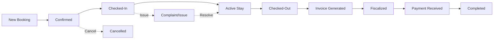

## System Overview

The Hotel Inventory Management System is an enterprise-grade platform designed for Hotel Porec operations. It provides comprehensive functionality for reservation management, financial operations, and multi-channel distribution.

<Note>
**Status**: Production Ready (v2.7) - All core modules completed and tested
</Note>

## System Modules

<CardGroup cols={2}>
  <Card title="Front Desk" icon="calendar-days" href="/features/front-desk">
    Timeline calendar with drag-to-create bookings and real-time conflict detection
  </Card>

  <Card title="Finance & Invoicing" icon="file-invoice-dollar" href="/features/finance">
    Complete invoice management with Croatian fiscal compliance
  </Card>

  <Card title="Channel Manager" icon="network-wired" href="/features/channel-manager">
    Multi-OTA synchronization with Booking.com, Expedia, Airbnb
  </Card>

  <Card title="Guest Management" icon="users" href="/features/reservations">
    Guest profiles, booking history, and communication
  </Card>
</CardGroup>

## Hotel Porec Configuration

### Property Details

```typescript
const HOTEL_POREC = {
  name: "Hotel Porec",
  location: "Croatia, Istria",
  taxId: "87246357068",  // OIB for fiscal compliance

  address: {
    street: "Istarska 123",
    city: "Poreč",
    postalCode: "52440",
    country: "Croatia"
  },

  contact: {
    phone: "+385 52 123 456",
    email: "info@hotelporec.hr",
    website: "www.hotelporec.hr"
  },

  // 46 rooms across 4 floors
  rooms: {
    total: 46,
    floors: [1, 2, 3, 4],
    types: [
      'Single Room',
      'Double Room',
      'Deluxe Room',
      'Family Room',
      'Suite'
    ]
  }
};
```

### Room Structure

```
Floor 1 (Rooms 101-113): 13 rooms
- Single: 101, 103, 105
- Double: 102, 104, 106, 108, 110, 112
- Deluxe: 107, 109, 111, 113

Floor 2 (Rooms 201-213): 13 rooms
- Single: 201, 203, 205
- Double: 202, 204, 206, 208, 210, 212
- Deluxe: 207, 209, 211, 213

Floor 3 (Rooms 301-312): 12 rooms
- Double: 301-310
- Suite: 311, 312

Floor 4 (Rooms 401-408): 8 rooms
- Deluxe: 401-406
- Suite: 407, 408
```

## Core Workflows

### Daily Operations

<Steps>
  <Step title="Morning Routine">
    **Check-Outs & Check-Ins**
    - Review departures (typically 10:00 AM)
    - Process check-outs and payments
    - Coordinate room cleaning
    - Prepare for arrivals (typically 3:00 PM)
    - Process check-ins
  </Step>

  <Step title="Reservation Management">
    **Throughout the Day**
    - Monitor new bookings from all channels
    - Handle room changes and updates
    - Process cancellations
    - Respond to special requests
  </Step>

  <Step title="Financial Operations">
    **End of Day**
    - Generate invoices for check-outs
    - Fiscalize invoices (Croatian compliance)
    - Record payments
    - Reconcile accounts
  </Step>

  <Step title="Channel Synchronization">
    **Continuous**
    - Real-time inventory updates to OTAs
    - Monitor booking confirmations
    - Resolve any conflicts
    - Update rates and availability
  </Step>
</Steps>

### Reservation Lifecycle



## Pricing & Revenue

### Seasonal Pricing

```typescript
enum SeasonalPeriod {
  Standard = 'standard',    // €80-120/night
  High = 'high',           // €120-180/night
  Peak = 'peak'           // €180-250/night
}

// Automatic seasonal rate application
const getSeasonalRate = (date: Date, baseRate: number) => {
  const month = date.getMonth();

  // Peak season: June-August
  if (month >= 5 && month <= 7) {
    return baseRate * 1.5;  // +50%
  }

  // High season: May, September
  if (month === 4 || month === 8) {
    return baseRate * 1.25; // +25%
  }

  // Standard: Rest of year
  return baseRate;
};
```

### Fee Structure

```typescript
const FEES = {
  // Croatian Tourism Tax (mandatory)
  tourismTax: 1.50,  // €1.50 per person per night

  // VAT (included in all prices)
  vatRate: 0.25,     // 25%

  // Optional services
  petFee: 15.00,     // Per stay
  parkingFee: 7.00,  // Per night
  breakfastFee: 12.00, // Per person

  // Short stay supplement
  shortStay: {
    threshold: 3,    // nights
    supplement: 0.20 // +20%
  },

  // Children discounts
  childrenRates: {
    age0to3: 0,      // Free
    age3to7: 0.50,   // 50% discount
    age7to14: 0.20   // 20% discount
  }
};
```

## Integration Architecture

### System Integrations

<CardGroup cols={2}>
  <Card title="Supabase (Database)" icon="database">
    - PostgreSQL database
    - Real-time subscriptions
    - Row-level security
    - Edge Functions
  </Card>

  <Card title="Croatian Tax Authority" icon="receipt">
    - FINA fiscalization API
    - JIR/ZKI generation
    - Digital signatures
    - QR code verification
  </Card>

  <Card title="Phobs (Channel Manager)" icon="network-wired">
    - OTA synchronization
    - Booking.com, Expedia, Airbnb
    - Real-time inventory
    - Rate management
  </Card>

  <Card title="Resend (Email)" icon="envelope">
    - Multi-language templates
    - Welcome emails
    - Thank you notes
    - Booking confirmations
  </Card>
</CardGroup>

### Data Flow

```
┌──────────────┐
│   Frontend   │ React 19 + TypeScript
│   (React)    │
└──────┬───────┘
       │
       ↓
┌──────────────┐
│Service Layer │ Business Logic
│   (TS)       │
└──────┬───────┘
       │
       ↓
┌──────────────┐
│   Supabase   │ Database + Auth
│  (Postgres)  │
└──────┬───────┘
       │
       ├──→ Croatian Tax Authority (Fiscalization)
       ├──→ Phobs API (Channel Manager)
       └──→ Resend API (Email Service)
```

## Multi-language Support

### Supported Languages

```typescript
const LANGUAGES = {
  en: 'English',     // Primary
  de: 'German',      // German tourists
  hr: 'Croatian',    // Local staff
  it: 'Italian'      // Italian tourists
};

// Email templates available in all languages
// UI translations for guest-facing features
// Staff interface primarily in Croatian
```

### Email Communication

```typescript
// Welcome email sent on check-in
const sendWelcomeEmail = async (guest: Guest, language: string) => {
  const templates = {
    en: 'welcome-en.html',
    de: 'welcome-de.html',
    it: 'welcome-it.html',
    hr: 'welcome-hr.html'
  };

  await emailService.send({
    to: guest.email,
    subject: t(`welcome.subject`, { lng: language }),
    template: templates[language],
    data: {
      guestName: guest.fullName,
      roomNumber: reservation.room.number,
      // ... hotel information
    }
  });
};
```

## Performance & Scalability

### System Metrics

<CardGroup cols={2}>
  <Card title="Response Time" icon="clock">
    - Page load: < 1 second
    - API calls: < 200ms
    - Real-time updates: < 100ms
    - PDF generation: < 2 seconds
  </Card>

  <Card title="Capacity" icon="chart-line">
    - 46 rooms (current)
    - Scalable to 200+ rooms
    - Multi-property support ready
    - Unlimited concurrent users
  </Card>

  <Card title="Reliability" icon="shield">
    - 99.9% uptime target
    - Automatic error recovery
    - Data backup (Supabase)
    - Offline capability (PWA)
  </Card>

  <Card title="Security" icon="lock">
    - Row-level security
    - Encrypted data storage
    - Secure API keys
    - Audit trail logging
  </Card>
</CardGroup>

### Performance Optimizations

```typescript
// Implemented optimizations
1. Optimistic UI updates (instant feedback)
2. Real-time subscriptions (Supabase)
3. Service Worker caching (PWA)
4. Code splitting by route
5. Lazy loading components
6. Virtual scrolling for lists
7. Database query optimization
8. Edge Function caching
```

## Compliance & Regulations

### Croatian Fiscal Compliance

<Steps>
  <Step title="FINA Certification">
    - P12 certificate required
    - Demo and production environments
    - Certificate password management
    - Automatic renewal tracking
  </Step>

  <Step title="Invoice Requirements">
    - Unique invoice numbers (HP-YYYY-NNNNNN)
    - JIR (Jedinstveni Identifikator Računa)
    - ZKI (Zaštitni Kod Izdavatelja)
    - QR code for verification
    - Digital signature
  </Step>

  <Step title="Tax Reporting">
    - 25% VAT on all services
    - €1.50 tourism tax per person/night
    - Real-time submission to Tax Authority
    - Audit trail maintenance
  </Step>

  <Step title="Data Retention">
    - 7-year fiscal data retention
    - Encrypted storage
    - Backup and recovery
    - GDPR compliance
  </Step>
</Steps>

### GDPR Compliance

```typescript
// Data protection measures
const GDPR_COMPLIANCE = {
  dataMinimization: true,    // Only collect necessary data
  encryptionAtRest: true,    // Database encryption
  encryptionInTransit: true, // HTTPS/TLS
  rightToErasure: true,      // Delete guest data on request
  dataPortability: true,     // Export guest data
  auditTrail: true,         // Log all data access
  privacyPolicy: true       // Guest consent tracking
};
```

## Monitoring & Analytics

### Business Intelligence

```typescript
// Available metrics
const ANALYTICS = {
  occupancy: {
    daily: number,
    weekly: number,
    monthly: number,
    yearly: number
  },

  revenue: {
    totalRevenue: number,
    averageDailyRate: number,
    revenuePerAvailableRoom: number,
    seasonalTrends: Record<SeasonalPeriod, number>
  },

  channels: {
    directBookings: number,
    otaBookings: number,
    channelPerformance: Record<OTAChannel, ChannelMetrics>
  },

  guests: {
    repeatGuests: number,
    averageStayLength: number,
    nationalityDistribution: Record<string, number>,
    vipCount: number
  }
};
```

### System Health

```typescript
// Monitoring dashboard
- Supabase connection status
- Edge Function response times
- Croatian Tax Authority availability
- Channel Manager sync status
- Error rates and types
- User activity metrics
```

## Future Roadmap

<CardGroup cols={2}>
  <Card title="Mobile Staff App" icon="mobile">
    Native iOS/Android app for hotel staff with offline capability
  </Card>

  <Card title="Multi-Property" icon="building">
    Manage multiple hotels from single dashboard
  </Card>

  <Card title="Revenue Management" icon="chart-mixed">
    AI-powered dynamic pricing optimization
  </Card>

  <Card title="Advanced Reporting" icon="file-chart-column">
    Business intelligence with forecasting
  </Card>
</CardGroup>

## Quick Links

<CardGroup cols={3}>
  <Card title="Front Desk" icon="calendar" href="/features/front-desk">
    Timeline operations
  </Card>

  <Card title="Finance" icon="euro-sign" href="/features/finance">
    Invoicing & fiscal
  </Card>

  <Card title="Channel Manager" icon="satellite-dish" href="/features/channel-manager">
    OTA integration
  </Card>

  <Card title="Technical Docs" icon="code" href="/technical/architecture">
    System architecture
  </Card>

  <Card title="Fiscalization" icon="receipt" href="/integrations/croatian-fiscalization">
    Croatian compliance
  </Card>

  <Card title="User Guides" icon="book" href="/guides/creating-reservations">
    Workflows
  </Card>
</CardGroup>

---

**System Version**: 2.7 (Finance UI Complete)
**Status**: ✅ Production Ready
**Hotel**: Hotel Porec, Croatia
**Rooms**: 46 across 4 floors
**Last Updated**: January 2025
