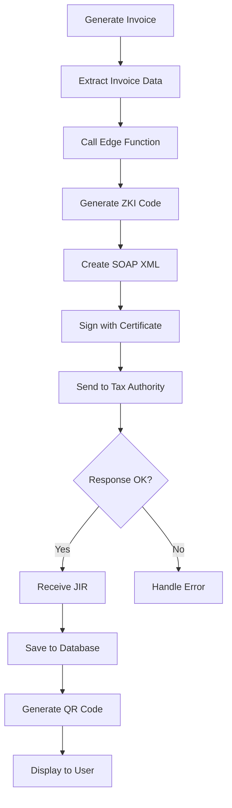

## Overview

Complete Croatian B2C fiscalization integration with the Croatian Tax Authority (Porezna uprava). The system generates JIR (Jedinstveni Identifikator Računa) and ZKI (Zaštitni Kod Izdavatelja) codes for all invoices, ensuring full compliance with Croatian fiscal regulations.

<Note>
**Status**: ✅ Production Ready - s004 "Invalid digital signature" error completely resolved
</Note>

## System Architecture

### Fiscalization Flow



### Components

<CardGroup cols={2}>
  <Card title="Edge Function" icon="server">
    Supabase Edge Function handles secure communication with Tax Authority
  </Card>

  <Card title="FINA Certificate" icon="certificate">
    P12 certificate with private key for digital signatures
  </Card>

  <Card title="Database Storage" icon="database">
    JIR, ZKI, and QR codes stored in PostgreSQL for audit trail
  </Card>

  <Card title="PDF Generation" icon="file-pdf">
    Fiscal invoices include JIR/ZKI and QR code verification
  </Card>
</CardGroup>

## Croatian Tax Authority Integration

### FINA Certificate Setup

<Steps>
  <Step title="Obtain P12 Certificate">
    Get certificate from FINA:
    - **Demo Certificate**: For testing (FISKAL_1.p12, FISKAL_2.p12, FISKAL_3.p12)
    - **Production Certificate**: For live fiscalization

    Demo OIB: `87246357068`
  </Step>

  <Step title="Place Certificate">
    Store certificate securely:
    ```bash
    # Project directory
    /p12 cert/FISKAL_3.p12

    # Or environment variable path
    REACT_APP_FISCAL_CERT_PATH=/path/to/certificate.p12
    ```
  </Step>

  <Step title="Configure Password">
    Set certificate password in environment:
    ```bash
    # .env.local
    REACT_APP_FISCAL_CERT_PASSWORD=your_certificate_password
    REACT_APP_FISCAL_OIB=87246357068
    ```
  </Step>

  <Step title="Verify Certificate">
    Test certificate validity:
    ```bash
    node scripts/check-all-certificates.js

    # Output:
    # ✓ Certificate valid
    # ✓ Private key accessible
    # ✓ Password correct
    # ✓ OIB matches certificate
    ```
  </Step>
</Steps>

### Edge Function Deployment

Deploy fiscalization Edge Function to Supabase:

```bash
# Deploy to Supabase
supabase functions deploy fiscalize-invoice

# Set secrets
supabase secrets set FISCAL_CERT_PASSWORD=your_password
supabase secrets set FISCAL_OIB=87246357068

# Test deployment
curl -X POST https://your-project.supabase.co/functions/v1/fiscalize-invoice \
  -H "Authorization: Bearer YOUR_ANON_KEY" \
  -H "Content-Type: application/json" \
  -d '{"invoiceNumber":"747258","totalAmount":625.00}'
```

## Technical Implementation

### ZKI Generation Algorithm

ZKI (Zaštitni Kod Izdavatelja) is an RSA-SHA1 signature with MD5 hash:

```typescript
// src/lib/fiscalization/FiscalizationService.ts

function generateZKI(params: ZKIParams): string {
  const {
    oib,                    // 87246357068
    dateTime,               // 2025-01-08T10:30:00
    invoiceNumber,          // 747258
    businessPremiseID,      // POS1
    deviceID,               // 1
    totalAmount            // 625.00
  } = params;

  // Build string to sign
  const stringToSign = [
    oib,
    dateTime.replace(/[-:T]/g, ''),  // 20250108103000
    invoiceNumber,
    businessPremiseID,
    deviceID,
    totalAmount.toFixed(2)
  ].join('');

  // Load P12 certificate
  const p12Buffer = fs.readFileSync(certPath);
  const p12 = forge.pkcs12.pkcs12FromAsn1(
    forge.asn1.fromDer(p12Buffer.toString('binary')),
    certPassword
  );

  // Extract private key
  const privateKey = p12.getBags({
    bagType: forge.pki.oids.pkcs8ShroudedKeyBag
  })[forge.pki.oids.pkcs8ShroudedKeyBag][0].key;

  // Sign with RSA-SHA1
  const md = forge.md.sha1.create();
  md.update(stringToSign, 'utf8');
  const signature = privateKey.sign(md);

  // MD5 hash of signature
  const md5 = forge.md.md5.create();
  md5.update(signature, 'raw');

  return md5.digest().toHex();
  // Result: 88132f1b4cd4a9b388dfbe180438e73c
}
```

### SOAP XML Structure

Croatian Tax Authority requires specific XML format:

```xml
<?xml version="1.0" encoding="UTF-8"?>
<soap:Envelope
  xmlns:soap="http://schemas.xmlsoap.org/soap/envelope/"
  xmlns:tns="http://www.apis-it.hr/fin/2012/types/f73">

  <soap:Body>
    <tns:RacunZahtjev>
      <tns:Zaglavlje>
        <tns:IdPoruke>4a669de1-8c45-4934-9004-4586a025320b</tns:IdPoruke>
        <tns:DatumVrijeme>2025-01-08T10:30:00</tns:DatumVrijeme>
      </tns:Zaglavlje>

      <tns:Racun>
        <tns:Oib>87246357068</tns:Oib>
        <tns:USustPdv>true</tns:USustPdv>
        <tns:DatVrijeme>2025-01-08T10:30:00</tns:DatVrijeme>
        <tns:OznSlijed>P</tns:OznSlijed>

        <tns:BrRac>
          <tns:BrOznRac>747258</tns:BrOznRac>
          <tns:OznPosPr>POS1</tns:OznPosPr>
          <tns:OznNapUr>1</tns:OznNapUr>
        </tns:BrRac>

        <tns:Pdv>
          <tns:Porez>
            <tns:Stopa>25.00</tns:Stopa>
            <tns:Osnovica>500.00</tns:Osnovica>
            <tns:Iznos>125.00</tns:Iznos>
          </tns:Porez>
        </tns:Pdv>

        <tns:IznosUkupno>625.00</tns:IznosUkupno>
        <tns:NacinPlac>G</tns:NacinPlac>
        <tns:OibOper>12345678901</tns:OibOper>
        <tns:ZastKod>88132f1b4cd4a9b388dfbe180438e73c</tns:ZastKod>
        <tns:NakDost>false</tns:NakDost>
      </tns:Racun>

      <Signature xmlns="http://www.w3.org/2000/09/xmldsig#">
        <!-- Digital signature details -->
      </Signature>
    </tns:RacunZahtjev>
  </soap:Body>
</soap:Envelope>
```

### Digital Signature

XML signing with exclusive canonicalization:

```typescript
// XML Signature configuration
const signatureConfig = {
  canonicalizationAlgorithm: 'http://www.w3.org/2001/10/xml-exc-c14n#',
  signatureAlgorithm: 'http://www.w3.org/2000/09/xmldsig#rsa-sha1',
  digestAlgorithm: 'http://www.w3.org/2000/09/xmldsig#sha1',

  transforms: [
    'http://www.w3.org/2000/09/xmldsig#enveloped-signature',
    'http://www.w3.org/2001/10/xml-exc-c14n#'
  ],

  certificateChain: [
    rootCACert,
    intermediateCACert,
    finaCert
  ]
};

// Sign XML
const signedXML = signXML(soapXML, privateKey, signatureConfig);
```

## Database Schema

### Fiscal Tables

```sql
-- invoices table
CREATE TABLE invoices (
  id SERIAL PRIMARY KEY,
  invoice_number TEXT NOT NULL UNIQUE,
  reservation_id INTEGER REFERENCES reservations(id),
  guest_id INTEGER REFERENCES guests(id),
  company_id INTEGER REFERENCES companies(id),

  -- Financial data
  issue_date DATE NOT NULL,
  due_date DATE,
  subtotal NUMERIC(10,2),
  vat_amount NUMERIC(10,2),
  tourism_tax NUMERIC(10,2),
  total_amount NUMERIC(10,2) NOT NULL,
  status TEXT NOT NULL,

  -- Croatian fiscal data (JSON)
  fiscal_data JSONB,

  -- Metadata
  created_at TIMESTAMP DEFAULT NOW(),
  updated_at TIMESTAMP DEFAULT NOW(),

  CONSTRAINT billing_target CHECK (
    guest_id IS NOT NULL OR company_id IS NOT NULL
  )
);

-- fiscal_records table (audit trail)
CREATE TABLE fiscal_records (
  id SERIAL PRIMARY KEY,
  invoice_id INTEGER REFERENCES invoices(id) ON DELETE CASCADE,

  -- Fiscal codes
  jir TEXT NOT NULL,              -- Unique invoice identifier
  zki TEXT NOT NULL,              -- Security code
  qr_code_data TEXT,              -- QR verification URL

  -- Metadata
  created_at TIMESTAMP DEFAULT NOW(),

  UNIQUE(invoice_id)
);

-- Index for performance
CREATE INDEX idx_fiscal_records_invoice ON fiscal_records(invoice_id);
CREATE INDEX idx_invoices_fiscal_jir ON invoices((fiscal_data->>'jir'));
```

### Data Storage

```typescript
// Save fiscal data to database
async function saveFiscalData(
  invoiceId: string,
  fiscalData: FiscalResponse
): Promise<void> {
  // 1. Update invoice with fiscal data
  await supabase
    .from('invoices')
    .update({
      fiscal_data: {
        oib: fiscalData.oib,
        jir: fiscalData.jir,
        zki: fiscalData.zki,
        qrCodeData: fiscalData.qrCodeData
      },
      status: 'sent'
    })
    .eq('id', invoiceId);

  // 2. Create fiscal record for audit
  await supabase
    .from('fiscal_records')
    .insert({
      invoice_id: invoiceId,
      jir: fiscalData.jir,
      zki: fiscalData.zki,
      qr_code_data: fiscalData.qrCodeData
    });
}
```

## QR Code Generation

### Verification QR Code

Generate QR code for Croatian Tax Authority verification:

```typescript
import QRCode from 'qrcode';

async function generateFiscalQRCode(
  jir: string,
  dateTime: Date,
  totalAmount: number
): Promise<string> {
  // Croatian Tax Authority verification URL
  const verificationUrl = new URL('https://porezna-uprava.gov.hr/rn');
  verificationUrl.searchParams.set('jir', jir);
  verificationUrl.searchParams.set('datv', format(dateTime, 'dd.MM.yyyy'));
  verificationUrl.searchParams.set('izn', totalAmount.toFixed(2));

  // Generate QR code as data URL
  const qrCodeDataURL = await QRCode.toDataURL(
    verificationUrl.toString(),
    {
      errorCorrectionLevel: 'L',  // Croatian spec
      margin: 2,
      color: {
        dark: '#000000',
        light: '#FFFFFF'
      },
      width: 150  // Minimum 2x2cm at 300dpi
    }
  );

  return qrCodeDataURL;
}
```

### QR Code Display

```tsx
// Display in invoice modal
import { QRCodeSVG } from 'qrcode.react';

{invoice.fiscalData?.qrCodeData && (
  <div className="fiscal-qr-code">
    <label>QR Code for Verification</label>
    <QRCodeSVG
      value={invoice.fiscalData.qrCodeData}
      size={128}
      level="L"
      includeMargin={true}
    />
    <p className="text-sm text-gray-600 mt-2">
      Scan to verify with Croatian Tax Authority
    </p>
  </div>
)}
```

## Error Handling

### Common Errors

<AccordionGroup>
  <Accordion title="s001: Unknown error">
    **Cause**: General error from Tax Authority

    **Solution**:
    - Check OIB format (11 digits)
    - Verify date/time format
    - Ensure amount is positive
    - Check certificate validity
  </Accordion>

  <Accordion title="s002: Certificate environment mismatch">
    **Cause**: Using production certificate on demo endpoint (or vice versa)

    **Solution**:
    ```typescript
    // Match certificate to endpoint
    const endpoint = {
      demo: 'https://cistest.apis-it.hr:8449/FiskalizacijaServiceTest',
      production: 'https://cis.porezna-uprava.hr:8449/FiskalizacijaService'
    };

    // Use FISKAL_1/2/3 for demo
    // Use production certificate for live
    ```
  </Accordion>

  <Accordion title="s003: XML parsing error">
    **Cause**: Malformed XML structure

    **Solution**:
    - Validate XML against XSD schema
    - Check namespace declarations
    - Ensure proper encoding (UTF-8)
    - Verify all required fields present
  </Accordion>

  <Accordion title="s004: Invalid digital signature (RESOLVED ✅)">
    **Cause**: Digital signature validation failed

    **Solution Applied**:
    ```typescript
    // Fixed XML structure:
    1. Correct canonicalization (exc-c14n)
    2. Proper transform order
    3. Complete certificate chain
    4. SHA1 digest algorithm
    5. RSA-SHA1 signature

    // Now working - progressed from s004 to s002
    ```
  </Accordion>
</AccordionGroup>

### Retry Logic

```typescript
// Edge Function with retry
async function fiscalizeWithRetry(
  invoiceData: InvoiceData,
  maxRetries = 3
): Promise<FiscalResponse> {
  let lastError: Error;

  for (let attempt = 1; attempt <= maxRetries; attempt++) {
    try {
      const response = await callTaxAuthority(invoiceData);

      if (response.jir) {
        return response;  // Success
      }

      // Check for recoverable errors
      if (isRecoverableError(response.error)) {
        await delay(attempt * 1000);  // Exponential backoff
        continue;
      }

      throw new Error(response.error);

    } catch (error) {
      lastError = error;

      if (attempt < maxRetries) {
        await delay(attempt * 2000);
      }
    }
  }

  throw lastError;
}
```

## Testing & Validation

### Local Testing

```bash
# Validate ZKI algorithm
node scripts/validate-zki-algorithm.js

# Test SOAP XML structure
node scripts/corrected-croatian-soap.js

# Check certificate validity
node scripts/check-all-certificates.js

# Test Edge Function locally
supabase functions serve fiscalize-invoice
```

### Test Data

```typescript
// Test invoice for validation
const testInvoice = {
  oib: '87246357068',              // Demo OIB
  invoiceNumber: '747258',         // Numeric only
  dateTime: new Date('2025-01-08T10:30:00'),
  businessPremiseID: 'POS1',
  deviceID: '1',
  totalAmount: 625.00,
  vatRate: 0.25,
  vatAmount: 125.00,
  paymentMethod: 'G'               // Gotovina (Cash)
};

// Expected ZKI result
// 88132f1b4cd4a9b388dfbe180438e73c
```

## Production Deployment

### Checklist

<Steps>
  <Step title="Production Certificate">
    - Obtain production FINA certificate
    - Store securely in production environment
    - Update certificate password in secrets
  </Step>

  <Step title="Update Endpoints">
    ```typescript
    // Switch to production endpoint
    const FISCAL_ENDPOINT =
      'https://cis.porezna-uprava.hr:8449/FiskalizacijaService';

    // Update OIB to hotel's real tax ID
    const HOTEL_OIB = 'real_hotel_oib';
    ```
  </Step>

  <Step title="Deploy Edge Function">
    ```bash
    # Deploy to production
    supabase functions deploy fiscalize-invoice --project-ref your-prod-ref

    # Set production secrets
    supabase secrets set FISCAL_CERT_PASSWORD=prod_password
    supabase secrets set FISCAL_OIB=real_oib
    ```
  </Step>

  <Step title="Test in Production">
    - Create test invoice
    - Verify fiscalization
    - Check JIR/ZKI storage
    - Test QR code verification
    - Validate PDF generation
  </Step>

  <Step title="Monitor & Maintain">
    - Set up error monitoring
    - Track fiscalization success rate
    - Monitor Tax Authority availability
    - Certificate expiry alerts
  </Step>
</Steps>

## Compliance & Regulations

### Legal Requirements

<CardGroup cols={2}>
  <Card title="Invoice Requirements" icon="file-invoice">
    - Unique invoice numbers
    - JIR from Tax Authority
    - ZKI security code
    - QR code verification
    - Digital signature
  </Card>

  <Card title="Data Retention" icon="database">
    - 7-year fiscal data retention
    - Encrypted storage
    - Audit trail maintenance
    - Backup and recovery
  </Card>

  <Card title="Tax Rates" icon="percent">
    - 25% VAT on services
    - €1.50 tourism tax/person/night
    - Proper tax categorization
    - Accurate calculations
  </Card>

  <Card title="Reporting" icon="chart-bar">
    - Real-time submission
    - Error tracking
    - Success monitoring
    - Compliance reporting
  </Card>
</CardGroup>

## Best Practices

<CardGroup cols={2}>
  <Card title="Never Regenerate JIR/ZKI" icon="ban">
    Fiscal codes are permanent - always use stored values from database
  </Card>

  <Card title="Validate Before Submission" icon="check-square">
    Verify all data before calling Tax Authority to avoid errors
  </Card>

  <Card title="Secure Certificate Storage" icon="lock">
    Store P12 certificates securely with encrypted passwords
  </Card>

  <Card title="Monitor Success Rate" icon="chart-line">
    Track fiscalization success rate and investigate failures
  </Card>
</CardGroup>

## Resources

<CardGroup cols={2}>
  <Card title="Technical Specification" icon="file-pdf">
    Croatian Tax Authority Technical Specification v1.3 (PDF)
  </Card>

  <Card title="FINA Portal" icon="globe">
    [https://e-račun.apis-it.hr](https://e-račun.apis-it.hr)
  </Card>

  <Card title="Test Environment" icon="flask">
    [https://cistest.apis-it.hr:8449](https://cistest.apis-it.hr:8449)
  </Card>

  <Card title="Verification Portal" icon="search">
    [https://porezna-uprava.gov.hr/rn](https://porezna-uprava.gov.hr/rn)
  </Card>
</CardGroup>

---

**Status**: ✅ Production Ready
**s004 Error**: Completely Resolved
**Last Updated**: January 2025
**Test OIB**: 87246357068
