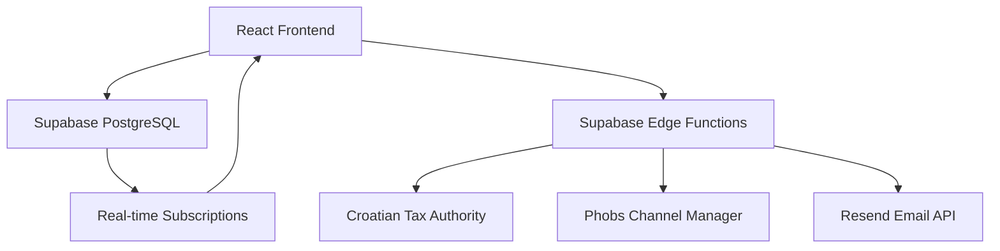

## Welcome to Hotel Inventory Management System

A comprehensive, production-ready hotel management platform featuring real-time operations, multi-channel distribution, and complete Croatian fiscal compliance. Built with enterprise-grade architecture and modern technologies.

<Note>
**Latest Update (November 2025)**: Enhanced label system with improved UI, R1 company billing support, and comprehensive reservation filtering capabilities.
</Note>

### Core Features

<CardGroup cols={2}>
  <Card
    title="Front Desk Operations"
    icon="hotel"
    href="/features/front-desk"
  >
    Professional 14-day timeline calendar with drag-to-create bookings, real-time conflict detection, and optimistic UI updates
  </Card>
  <Card
    title="Finance & Invoicing"
    icon="file-invoice-dollar"
    href="/features/finance"
  >
    Complete invoice management with Croatian fiscal compliance (JIR/ZKI), QR code verification, and PDF generation
  </Card>
  <Card
    title="Channel Manager Integration"
    icon="network-wired"
    href="/features/channel-manager"
  >
    Real-time OTA synchronization with Booking.com, Expedia, Airbnb, and 12+ platforms
  </Card>
  <Card
    title="Croatian Fiscalization"
    icon="receipt"
    href="/integrations/croatian-fiscalization"
  >
    Production-ready Croatian Tax Authority integration with FINA certificates and s004 error resolution
  </Card>
  <Card
    title="Guest Management"
    icon="users"
    href="/features/reservations"
  >
    Comprehensive guest profiles, booking history, and multi-language communication (EN/DE/IT/HR)
  </Card>
  <Card
    title="Advanced Analytics"
    icon="chart-line"
    href="/features/analytics"
  >
    Business intelligence dashboard with revenue forecasting and channel performance metrics
  </Card>
</CardGroup>

## What's New in v2.7

<CardGroup cols={1}>
  <Card title="✅ Enhanced Label System" icon="tags">
    **November 2025** - Advanced reservation labeling and categorization

    - Improved label UI with better visual indicators
    - Database integration for persistent labels
    - Label-based filtering and searching
    - Color-coded reservation groups
    - Timeline and room status label display
  </Card>

  <Card title="✅ R1 Company Billing Integration" icon="building">
    **November 2025** - Complete R1 billing system for corporate clients

    - R1 company selection in booking modal
    - PDF invoice generation with R1 branding
    - Country code conversion utilities
    - Payment flow integration
    - Invoice page R1 support and refresh functionality
  </Card>

  <Card title="✅ NFC Room Cleaning System" icon="mobile">
    **October 2025** - Automated room status management via NFC

    - NFC tag integration for instant room status updates
    - Real-time cleaning status indicators on timeline
    - Automated daily room status reset system
    - AM/PM toggle for room status overview
    - Toast notifications with progress animations
  </Card>

  <Card title="✅ Development Environment Improvements" icon="code">
    **October-November 2025** - Enhanced developer experience

    - Local Supabase development environment with seed data
    - Dual environment support (local/production)
    - MCP environment switching scripts
    - Comprehensive local development documentation
    - Improved build configuration
  </Card>
</CardGroup>

## Technology Stack

Built with cutting-edge, production-ready technologies:

### Frontend
- **React 19** - Latest React features with concurrent rendering
- **TypeScript** - Strict type safety with advanced patterns
- **Tailwind CSS** - Utility-first styling with shadcn/ui components
- **GSAP** - Smooth animations and transitions
- **React Router v7** - Type-safe routing with loaders
- **React DnD** - Drag-and-drop for reservations
- **i18next** - Multi-language support (EN/DE/HR/IT)

### Backend
- **Supabase** - PostgreSQL database with real-time subscriptions
- **Edge Functions** - Serverless functions for fiscal integration
- **Row-Level Security** - Database-level security policies
- **Real-time Subscriptions** - Live data synchronization

### Integrations
- **Croatian Tax Authority** - FINA fiscalization API
- **Phobs Channel Manager** - OTA distribution platform
- **Resend** - Email service with multi-language templates
- **jsPDF** - Professional invoice generation
- **QR Code** - Fiscal receipt verification

### Architecture
- **Service Layer Pattern** - Clean separation of concerns
- **Repository Pattern** - Database abstraction
- **Optimistic Updates** - Instant UI feedback
- **Error Boundaries** - Graceful error handling
- **Comprehensive Testing** - Jest with integration tests

## Quick Start

<Steps>
  <Step title="Clone Repository">
    Get the latest version from GitHub
    ```bash
    git clone https://github.com/your-username/hotel-inventory
    cd hotel-inventory
    ```
  </Step>

  <Step title="Install Dependencies">
    Install all required packages
    ```bash
    npm install
    ```
  </Step>

  <Step title="Environment Configuration">
    Set up environment variables for Supabase and integrations
    ```bash
    cp .env.sample .env.local
    # Edit .env.local with your credentials:
    # - Supabase URL and API keys
    # - Croatian fiscal certificate password
    # - Phobs API credentials (if using channel manager)
    ```
  </Step>

  <Step title="Database Setup">
    Run migrations to set up the database schema
    ```bash
    # Migrations are in supabase/migrations/
    # Apply via Supabase Dashboard or CLI
    ```
  </Step>

  <Step title="Start Development Server">
    Launch the application
    ```bash
    npm start
    ```
    Application available at `http://localhost:3000`
  </Step>
</Steps>

## Key System Components

### Hotel Front Desk Module
- **14-Day Timeline Calendar** - Professional scheduling interface
- **Drag-to-Create Bookings** - Intuitive reservation creation
- **Real-time Conflict Detection** - Prevent double bookings
- **Smart Context Menus** - Quick actions on reservations
- **Keyboard Shortcuts** - 20+ hotkeys for power users
- **Optimistic Updates** - Instant UI feedback

### Finance & Invoicing Module
- **Invoice Management** - Complete invoice lifecycle
- **Croatian Fiscal Compliance** - JIR/ZKI generation and storage
- **PDF Generation** - Professional invoices with fiscal data
- **QR Code Verification** - Tax Authority receipt validation
- **Payment Tracking** - Multi-method payment support
- **Real-time Updates** - Live invoice status synchronization

### Channel Manager Module
- **OTA Integration** - 13+ platforms including Booking.com, Expedia, Airbnb
- **Bidirectional Sync** - Real-time reservation and inventory updates
- **Conflict Resolution** - Intelligent handling of double bookings
- **Performance Monitoring** - Live dashboard with metrics
- **Error Recovery** - Comprehensive retry logic

### Guest Management
- **Comprehensive Profiles** - Contact details, preferences, history
- **Multi-language Communication** - Email templates in 4 languages
- **Booking History** - Complete stay records
- **VIP Management** - Special guest handling

## System Architecture



### Service Layer Architecture
- **HotelDataService** - Core data operations
- **ReservationService** - Booking management with fiscal integration
- **PhobsChannelManagerService** - OTA synchronization
- **ConflictDetectionService** - Real-time validation
- **OptimisticUpdateService** - UI state management
- **BatchOperationService** - Bulk operations
- **KeyboardShortcutService** - Power-user features

## Production Deployment Status

<CardGroup cols={2}>
  <Card title="Frontend" icon="check">
    ✅ Production Ready
    - Zero TypeScript errors
    - Optimized build
    - Responsive design
    - PWA support
  </Card>

  <Card title="Backend" icon="check">
    ✅ Production Ready
    - Supabase configured
    - RLS policies active
    - Edge Functions deployed
    - Real-time enabled
  </Card>

  <Card title="Croatian Fiscalization" icon="check">
    ✅ Production Ready
    - Tax Authority integration
    - JIR/ZKI generation
    - Certificate configured
    - QR code verification
  </Card>

  <Card title="Channel Manager" icon="check">
    ✅ Production Ready
    - Phobs API integrated
    - OTA sync active
    - Error handling robust
    - Monitoring dashboard
  </Card>
</CardGroup>

## Support & Resources

<CardGroup cols={2}>
  <Card
    title="Documentation"
    icon="book-open"
    href="/technical/architecture"
  >
    Comprehensive technical documentation and API references
  </Card>

  <Card
    title="Integration Guides"
    icon="puzzle-piece"
    href="/integrations/croatian-fiscalization"
  >
    Step-by-step guides for fiscal compliance and OTA integration
  </Card>

  <Card
    title="Development Setup"
    icon="code"
    href="/development/setup"
  >
    Local development environment configuration
  </Card>

  <Card
    title="User Guides"
    icon="graduation-cap"
    href="/guides/creating-reservations"
  >
    Workflow documentation for daily operations
  </Card>
</CardGroup>

## Next Steps

<CardGroup cols={3}>
  <Card title="Quick Start" icon="rocket" href="/quickstart">
    Get up and running in minutes
  </Card>

  <Card title="Features Overview" icon="star" href="/features/hotel-management">
    Explore all capabilities
  </Card>

  <Card title="API Reference" icon="code" href="/technical/api-reference">
    Technical documentation
  </Card>
</CardGroup>

---

**Version**: 2.7 (Enhanced Labels & R1 Billing)
**Status**: Production Ready
**Last Updated**: November 2025
**License**: Proprietary
