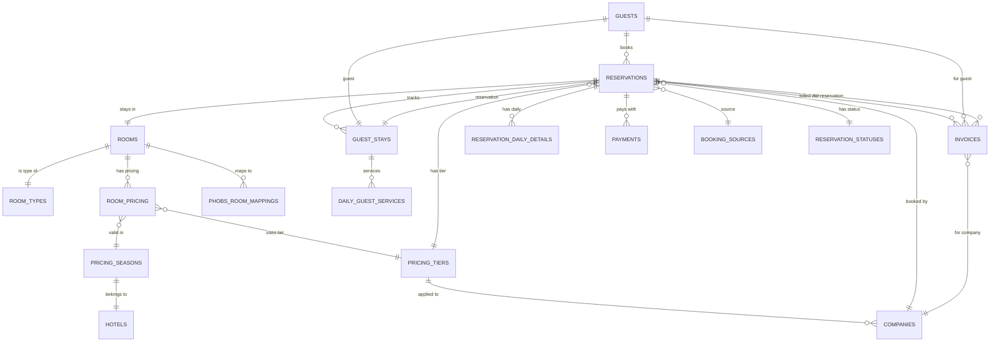
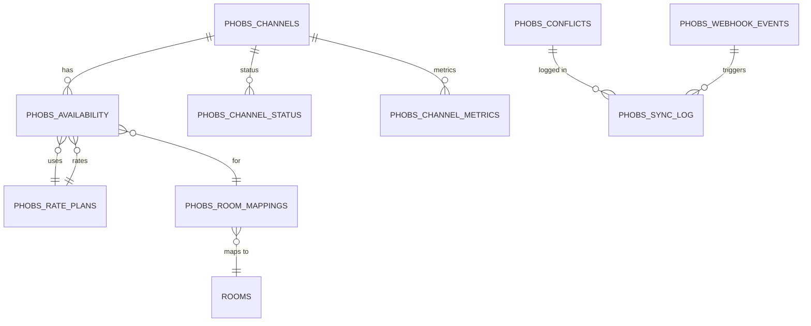
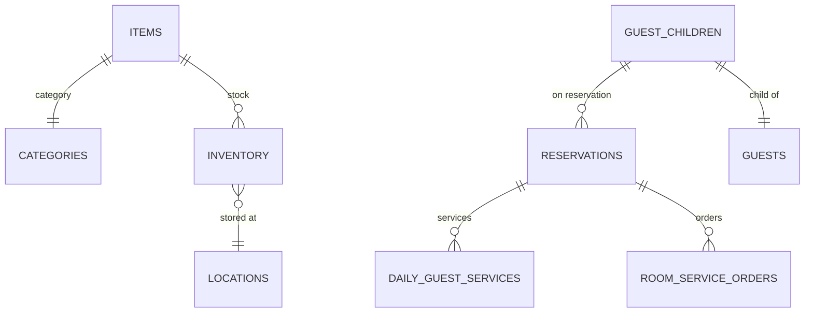
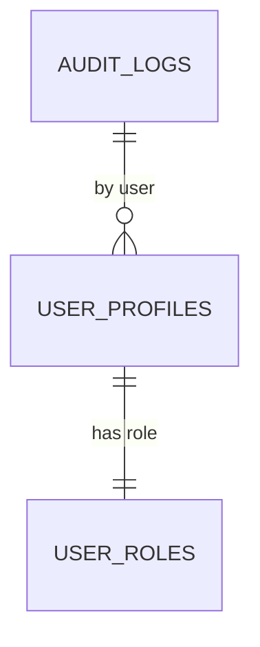

# Hotel Inventory Database Schema - ER Diagram

## Core Booking & Pricing Flow

## Phobs Channel Manager Integration

## Inventory & Services

## User & Audit

## Table Details by Category

### Core Booking Tables
- **reservations**: Main booking record with pricing calculations
- **guests**: Guest information
- **rooms**: Room inventory
- **room_types**: Room type definitions
- **reservation_statuses**: Status codes
- **booking_sources**: OTA and direct booking sources

### Pricing Tables
- **pricing_tiers**: Discount/rate configurations per company
- **pricing_seasons**: Seasonal periods (A, B, C, D)
- **room_pricing**: Room-specific pricing by season
- **phobs_rate_plans**: OTA rate configurations

### Financial Tables
- **invoices**: Generated bills
- **payments**: Payment records
- **fiscal_records**: Tax/fiscal submission records

### Guest & Stay Details
- **guest_stays**: Check-in/out tracking
- **guest_children**: Children on reservation
- **daily_guest_services**: Daily services (parking, pets, etc.)
- **reservation_daily_details**: Daily rate breakdown

### Channel Manager (Phobs)
- **phobs_channels**: OTA channel configurations
- **phobs_room_mappings**: Internal to OTA room mapping
- **phobs_availability**: Availability and rates per channel
- **phobs_conflicts**: Sync conflict detection
- **phobs_webhook_events**: Incoming OTA events
- **phobs_sync_log**: Sync operation history

### Inventory
- **items**: Inventory items
- **categories**: Item categories
- **locations**: Storage locations
- **inventory**: Stock tracking
- **room_service_orders**: Service charges

### System
- **user_profiles**: User accounts
- **user_roles**: User roles
- **audit_logs**: Change tracking
