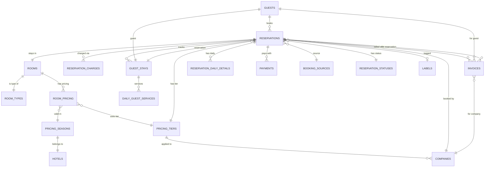
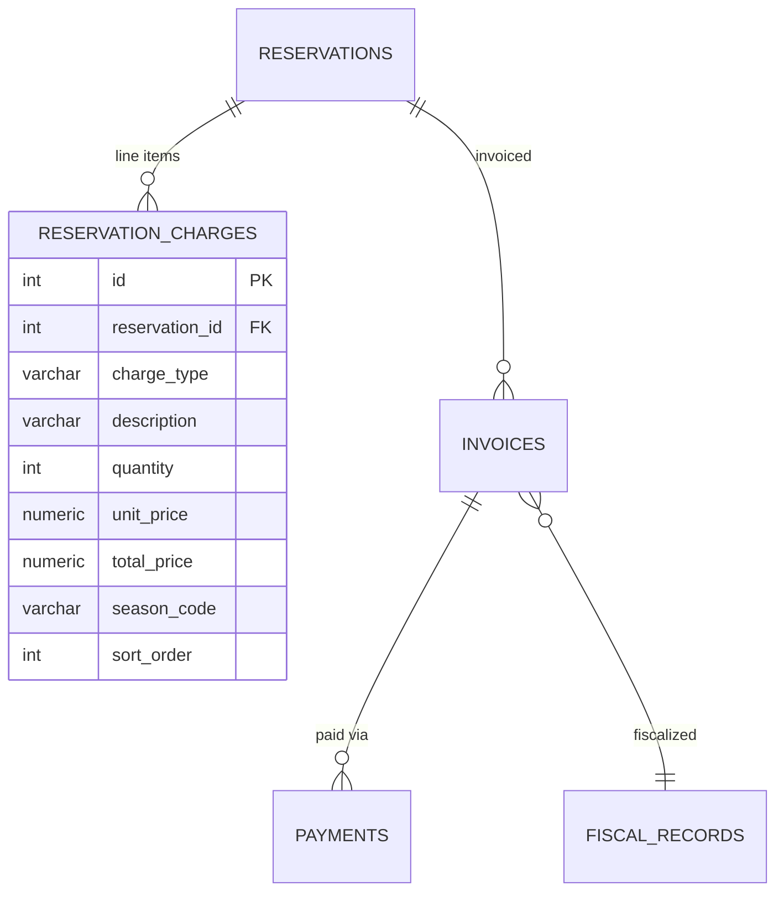
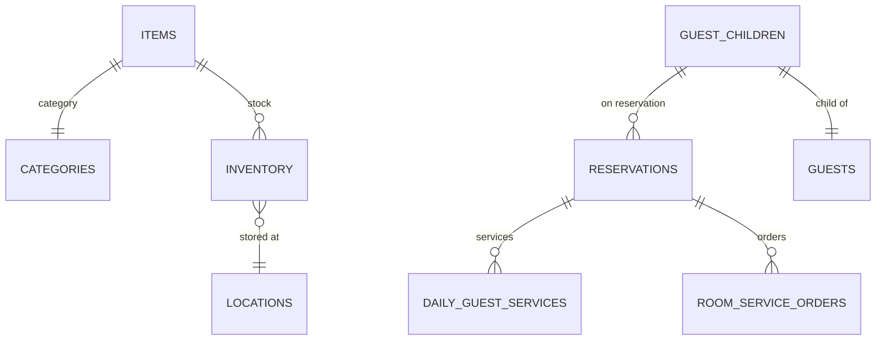
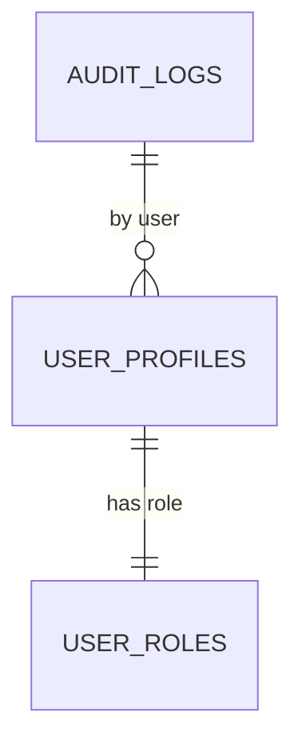

# Hotel Porec Database Schema

**Project:** hp-duga (`gkbpthurkucotikjefra`)
**Updated:** 2026-03-29
**30 tables** in `public` schema.

## Core Booking & Pricing Flow

```mermaid
erDiagram
    GUESTS ||--o{ RESERVATIONS : books
    RESERVATIONS ||--|| ROOMS : "stays in"
    RESERVATIONS ||--o{ RESERVATION_CHARGES : "charged via"
    RESERVATIONS ||--o{ INVOICES : "billed with"
    RESERVATIONS ||--o{ GUEST_STAYS : "tracks"
    RESERVATIONS ||--o{ RESERVATION_DAILY_DETAILS : "has daily"
    RESERVATIONS ||--o{ PAYMENTS : "pays with"

    ROOMS ||--|| ROOM_TYPES : "is type of"
    ROOMS ||--o{ ROOM_PRICING : "has pricing"

    ROOM_PRICING }o--|| PRICING_SEASONS : "valid in"
    ROOM_PRICING }o--|| PRICING_TIERS : "uses tier"

    PRICING_SEASONS ||--|| HOTELS : "belongs to"
    PRICING_TIERS ||--o{ COMPANIES : "applied to"

    RESERVATIONS }o--|| PRICING_TIERS : "has tier"
    RESERVATIONS }o--|| COMPANIES : "booked by"
    RESERVATIONS }o--|| BOOKING_SOURCES : "source"
    RESERVATIONS }o--|| RESERVATION_STATUSES : "has status"
    RESERVATIONS }o--o| LABELS : "tagged"

    INVOICES }o--|| GUESTS : "for guest"
    INVOICES }o--|| COMPANIES : "for company"
    INVOICES }o--|| RESERVATIONS : "for reservation"

    GUEST_STAYS ||--|| GUESTS : "guest"
    GUEST_STAYS ||--|| RESERVATIONS : "reservation"
    GUEST_STAYS ||--o{ DAILY_GUEST_SERVICES : "services"
```

## Financial & Charges

```mermaid
erDiagram
    RESERVATION_CHARGES {
        int id PK
        int reservation_id FK
        varchar charge_type
        varchar description
        int quantity
        numeric unit_price
        numeric total_price
        varchar season_code
        int sort_order
    }
    INVOICES ||--o{ PAYMENTS : "paid via"
    INVOICES }o--|| FISCAL_RECORDS : "fiscalized"
    RESERVATIONS ||--o{ RESERVATION_CHARGES : "line items"
    RESERVATIONS ||--o{ INVOICES : "invoiced"
```

## Inventory & Room Service

```mermaid
erDiagram
    ITEMS ||--|| CATEGORIES : "category"
    ITEMS ||--o{ INVENTORY : "stock"
    INVENTORY }o--|| LOCATIONS : "stored at"

    RESERVATIONS ||--o{ DAILY_GUEST_SERVICES : "services"
    RESERVATIONS ||--o{ ROOM_SERVICE_ORDERS : "orders"

    GUEST_CHILDREN ||--|| GUESTS : "child of"
    GUEST_CHILDREN ||--o{ RESERVATIONS : "on reservation"
```

## Auth & Audit

```mermaid
erDiagram
    USER_PROFILES ||--|| USER_ROLES : "has role"
    AUDIT_LOGS ||--o{ USER_PROFILES : "by user"
```

## Table Summary by Domain

| Domain | Tables |
|--------|--------|
| Auth | `user_roles`, `user_profiles`, `audit_logs` |
| Hotel/Rooms | `hotels`, `room_types`, `rooms`, `room_cleaning_reset_log` |
| Pricing | `pricing_seasons`, `pricing_tiers`, `room_pricing`, `booking_sources`, `labels` |
| Guests | `guests`, `guest_children`, `companies` |
| Reservations | `reservation_statuses`, `reservations`, `reservation_guests`, `reservation_daily_details`, `guest_stays`, `daily_guest_services` |
| Financials | `reservation_charges`, `invoices`, `payments`, `fiscal_records`, `room_service_orders` |
| Inventory | `categories`, `items`, `locations`, `inventory` |

## Key Table Descriptions

### Reservations & Charges
- **reservations** — Main booking record linking guest, room, dates, status, and pricing tier
- **reservation_charges** — Line-item charges (accommodation per season, tourism tax, parking, pets, short-stay supplement). Generated by `UnifiedPricingService`
- **reservation_statuses** — Status codes: `confirmed`, `checked-in`, `checked-out`, `room-closure`, `unallocated`, `incomplete-payment`
- **booking_sources** — Where the booking came from: `booking.com`, `direct`, `other`
- **labels** — Color-coded tags for reservations (VIP, corporate, etc.)

### Pricing
- **pricing_seasons** — Seasonal periods A (low/winter), B (shoulder), C (summer), D (peak Jul-Aug)
- **pricing_tiers** — Rate structures with seasonal rates A-D and optional percentage discounts
- **room_pricing** — Per-room, per-season base rates

### Financial
- **invoices** — Generated from reservation charges, supports R1 (company) billing
- **payments** — Payment records (cash, card, bank transfer, Booking.com)
- **fiscal_records** — Croatian tax authority (e-Racuni) JIR/ZKI codes and QR data
