# Database Schema

> Generated from live DB on 2026-03-19, updated 2026-03-19 (migrations 001–004)
> Supabase project: `gkbpthurkucotikjefra`

This document describes the full public schema of the hotel-inventory PostgreSQL database, including all tables, columns (with data types), relationships, and a Mermaid ER diagram.

---

## ER Diagram

```mermaid
erDiagram

    %% ─── REFERENCE / LOOKUP TABLES ─────────────────────────────────────────

    hotels {
        int     id PK
        text    name
        jsonb   address
        jsonb   contact_info
        text    oib
        timestamptz created_at
        timestamptz updated_at
    }

    room_types {
        int     id PK
        varchar code UK
        varchar name
        int     max_occupancy
        int     base_area_sqm
        text    description
        varchar color
        varchar icon
        bool    is_active
        int     display_order
        timestamptz created_at
    }

    reservation_statuses {
        int     id PK
        varchar code UK
        varchar name
        varchar color
        varchar icon
        text    description
        bool    is_active
        int     display_order
        timestamptz created_at
    }

    booking_sources {
        int     id PK
        varchar code UK
        varchar name
        numeric default_commission_rate
        jsonb   api_config
        varchar color
        varchar icon
        bool    is_active
        int     display_order
        timestamptz created_at
    }

    user_roles {
        int     id PK
        varchar name UK
        text    description
        timestamptz created_at
    }

    %% ─── PRICING ────────────────────────────────────────────────────────────

    pricing_tiers {
        int     id PK
        varchar name UK
        text    description
        numeric seasonal_rate_a
        numeric seasonal_rate_b
        numeric seasonal_rate_c
        numeric seasonal_rate_d
        bool    is_percentage_discount
        int     minimum_stay
        date    valid_from
        date    valid_to
        bool    is_active
        bool    is_default
        timestamptz created_at
        timestamptz updated_at
    }

    pricing_seasons {
        int     id PK
        int     hotel_id
        varchar name
        varchar code
        date    start_date
        date    end_date
        int     year_pattern
        int     priority
        bool    is_active
        varchar color
        timestamptz created_at
    }

    %% ─── ROOMS ──────────────────────────────────────────────────────────────

    rooms {
        int     id PK
        varchar room_number UK
        int     floor_number
        varchar room_type
        int     max_occupancy
        bool    is_premium
        numeric seasonal_rate_a
        numeric seasonal_rate_b
        numeric seasonal_rate_c
        numeric seasonal_rate_d
        jsonb   amenities
        bool    is_active
        bool    is_clean
        int     room_type_id FK
        timestamptz created_at
        timestamptz updated_at
    }

    room_pricing {
        int     id PK
        int     room_id FK
        int     season_id FK
        numeric base_rate
        varchar currency
        date    valid_from
        date    valid_to
        timestamptz created_at
    }

    room_cleaning_reset_log {
        int     id PK
        int     rooms_reset
        timestamptz executed_at
        text    triggered_by
    }

    %% ─── GUESTS & COMPANIES ─────────────────────────────────────────────────

    guests {
        int     id PK
        varchar first_name
        varchar last_name
        varchar full_name "GENERATED: first_name || ' ' || last_name"
        varchar email UK
        varchar phone
        varchar nationality
        varchar country_code
        date    date_of_birth
        varchar passport_number
        varchar id_card_number
        varchar preferred_language
        text[]  dietary_restrictions
        text    special_needs
        bool    has_pets
        bool    is_vip
        int     vip_level
        bool    marketing_consent
        int     total_stays
        numeric total_spent
        numeric average_rating
        date    last_stay_date
        text    notes
        timestamptz created_at
        timestamptz updated_at
    }

    companies {
        int     id PK
        varchar name
        varchar oib UK
        text    address
        varchar city
        varchar postal_code
        varchar country
        varchar contact_person
        varchar email
        varchar phone
        varchar fax
        int     pricing_tier_id FK
        int     room_allocation_guarantee
        bool    is_active
        text    notes
        timestamptz created_at
        timestamptz updated_at
    }

    %% ─── LABELS ─────────────────────────────────────────────────────────────

    labels {
        uuid    id PK
        int     hotel_id FK
        text    name
        text    color
        text    bg_color
        timestamptz created_at
        timestamptz updated_at
    }

    %% ─── RESERVATIONS ───────────────────────────────────────────────────────

    reservations {
        int     id PK
        int     guest_id FK
        int     room_id FK
        int     status_id FK
        int     booking_source_id FK
        int     company_id FK
        int     pricing_tier_id FK
        uuid    label_id FK
        date    check_in_date
        date    check_out_date
        int     number_of_nights "GENERATED: check_out_date - check_in_date"
        int     number_of_guests
        int     adults
        int     children_count
        varchar status
        varchar booking_source
        varchar seasonal_period
        text    special_requests
        text    internal_notes
        numeric base_room_rate
        numeric subtotal
        numeric children_discounts
        numeric tourism_tax
        numeric vat_amount
        numeric pet_fee
        numeric parking_fee
        numeric short_stay_supplement
        numeric additional_charges
        numeric total_amount
        varchar payment_status
        varchar payment_method
        numeric deposit_amount
        numeric balance_due
        numeric commission_rate
        numeric commission_amount
        numeric net_amount
        bool    has_pets
        bool    parking_required
        bool    is_r1
        varchar confirmation_number UK
        varchar booking_reference
        timestamptz booking_date
        timestamptz checked_in_at
        timestamptz checked_out_at
        timestamptz last_modified
        timestamptz created_at
        timestamptz updated_at
    }

    reservation_guests {
        int     id PK
        int     reservation_id FK
        int     guest_id FK
        timestamptz created_at
        timestamptz updated_at
    }

    reservation_daily_details {
        int     id PK
        int     reservation_id FK
        date    stay_date
        int     adults_present
        int[]   children_present
        int     parking_spots_needed
        bool    pets_present
        int     towel_rentals
        numeric daily_base_accommodation
        numeric daily_child_discounts
        numeric daily_service_fees
        numeric daily_total
        text    notes
        timestamptz created_at
        timestamptz updated_at
    }

    guest_children {
        int     id PK
        int     reservation_id FK
        int     guest_id FK
        varchar name
        date    date_of_birth
        int     age
        varchar discount_category
        timestamptz created_at
    }

    guest_stays {
        int     id PK
        int     reservation_id FK
        int     guest_id FK
        timestamptz check_in
        timestamptz check_out
        timestamptz actual_check_in
        timestamptz actual_check_out
        timestamptz created_at
        timestamptz updated_at
    }

    daily_guest_services {
        int     id PK
        int     guest_stay_id FK
        date    service_date
        int     parking_spots
        bool    pet_fee
        int     extra_towels
        bool    extra_bed
        jsonb   minibar_consumed
        bool    tourism_tax_paid
        numeric tourism_tax_amount
        text    notes
        timestamptz created_at
        timestamptz updated_at
    }

    %% ─── BILLING ────────────────────────────────────────────────────────────

    invoices {
        int     id PK
        varchar invoice_number UK
        int     reservation_id FK
        int     guest_id FK
        int     company_id FK
        date    issue_date
        date    due_date
        date    paid_date
        numeric subtotal
        numeric children_discounts
        numeric tourism_tax
        numeric vat_amount
        numeric pet_fee
        numeric parking_fee
        numeric short_stay_supplement
        numeric additional_charges
        numeric total_amount
        numeric paid_amount
        numeric balance_due
        varchar status
        text    pdf_path
        timestamptz email_sent_at
        text    notes
        timestamptz created_at
        timestamptz updated_at
    }

    payments {
        int     id PK
        int     invoice_id FK
        int     reservation_id FK
        numeric amount
        varchar currency
        varchar payment_method
        varchar payment_reference
        varchar card_last_four
        varchar card_type
        varchar authorization_code
        varchar status
        timestamptz received_date
        timestamptz processed_date
        text    notes
        timestamptz created_at
    }

    fiscal_records {
        int     id PK
        int     invoice_id FK
        varchar jir
        varchar zki
        timestamptz submitted_at
        varchar response_status
        text    response_message
        text    qr_code_data
        varchar operator_oib
        varchar business_space_code
        int     register_number
        timestamptz created_at
    }

    %% ─── INVENTORY ──────────────────────────────────────────────────────────

    categories {
        int     id PK
        varchar name UK
        text    description
        bool    requires_expiration
        timestamptz created_at
    }

    items {
        int     id PK
        varchar name
        text    description
        int     category_id FK
        varchar unit
        numeric price
        int     minimum_stock
        bool    is_active
        timestamptz created_at
        timestamptz updated_at
    }

    locations {
        int     id PK
        varchar name UK
        varchar type
        text    description
        bool    is_refrigerated
        timestamptz created_at
    }

    inventory {
        int     id PK
        int     item_id FK
        int     location_id FK
        int     quantity
        date    expiration_date
        numeric cost_per_unit
        int     display_order
        timestamptz created_at
        timestamptz updated_at
    }

    %% ─── ROOM SERVICE ───────────────────────────────────────────────────────

    room_service_orders {
        int     id PK
        int     reservation_id FK
        varchar item_name
        varchar category
        int     quantity
        numeric unit_price
        numeric total_price
        timestamptz ordered_at
        timestamptz created_at
    }

    %% ─── VIEWS ──────────────────────────────────────────────────────────────

    guest_stats {
        int     guest_id FK
        bigint  total_reservations "COMPUTED: COUNT(reservations)"
        numeric total_spent        "COMPUTED: SUM(total_amount)"
        date    first_stay         "COMPUTED: MIN(check_in_date)"
        date    last_stay          "COMPUTED: MAX(check_in_date)"
    }

    %% ─── USERS & AUDIT ──────────────────────────────────────────────────────

    user_profiles {
        uuid    id PK
        uuid    user_id UK
        int     role_id FK
        bool    is_active
        bool    push_notifications_enabled
        text    push_subscription
        timestamptz created_at
        timestamptz updated_at
    }

    audit_logs {
        int     id PK
        uuid    user_id
        varchar action
        varchar table_name
        text    record_id
        jsonb   old_values
        jsonb   new_values
        text    description
        timestamptz created_at
    }

    %% ─── RELATIONSHIPS ──────────────────────────────────────────────────────

    %% Room hierarchy
    room_types ||--o{ rooms : "defines type of"
    rooms ||--o{ room_pricing : "has rates in"
    pricing_seasons ||--o{ room_pricing : "covers"

    %% Hotel hierarchy
    hotels ||--o{ labels : "owns"
    hotels ||--o{ pricing_seasons : "defines"

    %% Guest & company
    pricing_tiers ||--o{ companies : "applied to"
    pricing_tiers ||--o{ reservations : "applied to"

    %% Reservations — core links
    guests ||--o{ reservations : "primary guest of"
    rooms ||--o{ reservations : "assigned to"
    reservation_statuses ||--o{ reservations : "categorises"
    booking_sources ||--o{ reservations : "originated from"
    companies ||--o{ reservations : "corporate account for"
    labels ||--o{ reservations : "groups"

    %% Reservation details
    reservations ||--o{ reservation_guests : "includes"
    guests ||--o{ reservation_guests : "linked via"
    reservations ||--o{ reservation_daily_details : "broken into"
    reservations ||--o{ guest_children : "accompanies"
    guests ||--o{ guest_children : "parent of"

    %% Stay tracking
    reservations ||--o{ guest_stays : "generates"
    guests ||--o{ guest_stays : "recorded in"
    guest_stays ||--o{ daily_guest_services : "logged per day in"

    %% Billing
    reservations ||--o{ invoices : "billed via"
    guests ||--o{ invoices : "billed to"
    companies ||--o{ invoices : "billed to"
    invoices ||--o{ payments : "settled by"
    invoices ||--o{ fiscal_records : "fiscalised as"
    reservations ||--o{ payments : "paid via"

    %% Room service
    reservations ||--o{ room_service_orders : "requests"

    %% Inventory
    categories ||--o{ items : "classifies"
    items ||--o{ inventory : "stocked at"
    locations ||--o{ inventory : "stores"

    %% Views
    guests ||--|| guest_stats : "aggregated in"

    %% Users
    user_roles ||--o{ user_profiles : "grants"
```

---

## Table Descriptions

### Reference / Lookup Tables

| Table | RLS | Rows | Purpose |
|---|---|---|---|
| `hotels` | No | 0 | Top-level hotel entity; holds name, address (JSONB), contact info, and OIB (Croatian tax ID). |
| `room_types` | No | 0 | Canonical room-type definitions (e.g., single, double, suite) with occupancy limits, area, and display metadata. |
| `reservation_statuses` | No | 0 | Configurable status codes for reservations (e.g., confirmed, checked-in, cancelled) with colour and icon metadata. |
| `booking_sources` | No | 0 | Configurable booking channels (e.g., Booking.com, Airbnb, direct) with default commission rates and API config. |
| `user_roles` | Yes | 0 | Role definitions for RBAC (e.g., admin, front-desk). |

### Pricing

| Table | RLS | Rows | Purpose |
|---|---|---|---|
| `pricing_tiers` | Yes | 0 | Named discount/rate tiers (A–D seasonal multipliers) assignable to companies or individual reservations. |
| `pricing_seasons` | No | 0 | Date-range seasons (A/B/C/D) per hotel, used as the axis for room pricing. |
| `room_pricing` | No | 0 | Specific base rates per room per season, with validity dates and currency. |

### Rooms

| Table | RLS | Rows | Purpose |
|---|---|---|---|
| `rooms` | Yes | 0 | Physical (and virtual) hotel rooms. Floor 5 (rooms 501+) is reserved for unallocated/virtual reservations. Stores per-room seasonal rates, amenities (JSONB), and cleaning status. |
| `room_cleaning_reset_log` | No | 22 | Audit log of automated nightly cleaning-status resets, recording how many rooms were reset and when. |

### Guests & Companies

| Table | RLS | Rows | Purpose |
|---|---|---|---|
| `guests` | Yes | 3 | Guest master record with contact info, identity documents, VIP status, dietary/pet preferences, and lifetime stay statistics. |
| `companies` | Yes | 0 | Corporate accounts for B2B bookings, with OIB validation, address, and optional pricing-tier assignment. |

### Labels

| Table | RLS | Rows | Purpose |
|---|---|---|---|
| `labels` | Yes | 0 | Colour-coded tags (UUID PK, lowercase hyphenated name) scoped to a hotel, used to group related reservations (e.g., tour groups). |

### Reservations

| Table | RLS | Rows | Purpose |
|---|---|---|---|
| `reservations` | Yes | 10 | Central booking record. Links guest, room, status, booking source, company, pricing tier, and label. Carries full financial breakdown (subtotal, VAT, tourism tax, fees). `number_of_nights` is a generated column. The `is_r1` flag marks company-invoiced (R1) bookings. |
| `reservation_guests` | Yes | 10 | Many-to-many join: additional guests associated with a reservation beyond the primary guest. |
| `reservation_daily_details` | No | 0 | Per-night breakdown of a reservation: occupant counts, parking, pets, towel rentals, and daily costs. |
| `guest_children` | Yes | 0 | Children travelling on a reservation, with age, DOB, and discount category. |

### Stay Tracking

| Table | RLS | Rows | Purpose |
|---|---|---|---|
| `guest_stays` | Yes | 10 | Operational check-in/check-out record per guest per reservation, with both scheduled and actual timestamps. |
| `daily_guest_services` | Yes | 0 | Day-level services consumed during a stay: parking spots, pet fee, extra towels, extra bed, minibar (JSONB), and tourism-tax tracking. |

### Billing

| Table | RLS | Rows | Purpose |
|---|---|---|---|
| `invoices` | Yes | 0 | Invoice header linking a reservation to either a guest or company, with full fee breakdown, status lifecycle (draft → sent → paid → overdue → cancelled), and a generated `balance_due` column. |
| `payments` | Yes | 0 | Individual payment transactions against an invoice or reservation; supports cash, credit/debit card, bank transfer. |
| `fiscal_records` | Yes | 0 | Croatian fiscalisation records (JIR/ZKI codes) generated when an invoice is submitted to the tax authority. |

### Inventory

| Table | RLS | Rows | Purpose |
|---|---|---|---|
| `categories` | Yes | 0 | Product categories for inventory items (e.g., linens, minibar, cleaning supplies); can require expiration tracking. |
| `items` | Yes | 3 | Inventory item master (name, unit, price, minimum stock threshold). |
| `locations` | Yes | 1 | Physical storage locations (e.g., storeroom, bar); flagged for refrigeration if applicable. |
| `inventory` | Yes | 1 | Current stock levels: links item to location with quantity, expiration date, cost per unit, and display order. |

### Room Service

| Table | RLS | Rows | Purpose |
|---|---|---|---|
| `room_service_orders` | Yes | 0 | Individual room-service line items linked to a reservation, with item name, category, quantity, unit price, and total. |

### Users & Audit

| Table | RLS | Rows | Purpose |
|---|---|---|---|
| `user_profiles` | Yes | 0 | Extended profile for each Supabase auth user: role assignment, active flag, and push-notification subscription data. |
| `audit_logs` | Yes | 7 | Immutable event log capturing who performed what action on which table/record, with old/new JSONB snapshots. |

---

## Notes

- **RLS** = Row Level Security enabled in Supabase.
- **Fiscal compliance**: The `fiscal_records` table implements Croatian eRačun/fiscalisation (JIR = unique invoice identifier from tax authority; ZKI = operator-generated security code).
- **Generated columns**: `guests.full_name` is always `first_name || ' ' || last_name`; `reservations.number_of_nights` is always `check_out_date - check_in_date`. Both are `GENERATED ALWAYS STORED` — do not insert/update them manually.
- **guest_stats view**: Replaces the denormalized `total_stays` / `total_spent` / `average_rating` columns on `guests` with live computed aggregates. Query this view for accurate lifetime stats.
- **Virtual rooms**: Rooms with `floor_number = 5` (501+) are virtual placeholders for unallocated reservations.
- **Label system**: `labels.id` is a UUID (not integer) and uses `uuid_generate_v4()`. `reservations.label_id` is correspondingly `uuid`.
