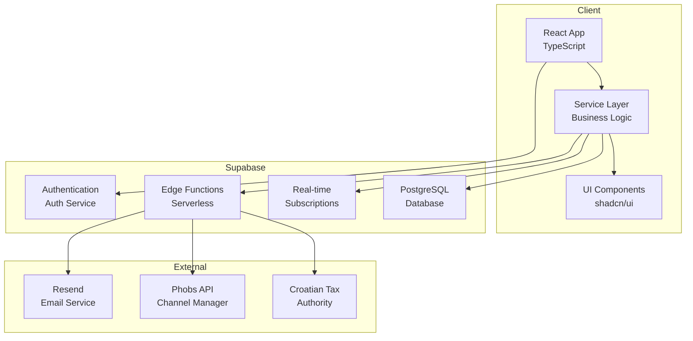

## Architecture Overview

The system follows a modern, scalable architecture with clean separation of concerns using React for the frontend, Supabase for backend services, and Edge Functions for serverless operations.

## High-Level Architecture



## Frontend Architecture

### Component Structure

```
src/
├── components/
│   ├── hotel/
│   │   ├── frontdesk/          # Timeline and reservations
│   │   ├── finance/            # Invoicing and payments
│   │   ├── ChannelManager/     # OTA integration UI
│   │   └── shared/             # Shared hotel components
│   └── ui/                     # Reusable UI primitives
├── lib/
│   ├── hotel/
│   │   ├── services/           # Business logic layer
│   │   ├── state/              # Context management
│   │   └── types.ts            # TypeScript definitions
│   ├── fiscalization/          # Croatian fiscal system
│   └── supabase.ts             # Database client
└── App.tsx                     # Root component
```

### Service Layer Pattern

```typescript
// Service layer abstraction
export class ReservationService {
  private db: DatabaseAdapter;
  private conflict: ConflictDetectionService;
  private optimistic: OptimisticUpdateService;

  async createReservation(data: ReservationCreate): Promise<Reservation> {
    // 1. Validate and detect conflicts
    await this.conflict.check(data);

    // 2. Optimistic UI update
    const optimisticId = this.optimistic.create(data);

    try {
      // 3. Database operation
      const reservation = await this.db.createReservation(data);

      // 4. Confirm optimistic update
      this.optimistic.confirm(optimisticId, reservation);

      return reservation;
    } catch (error) {
      // 5. Rollback on error
      this.optimistic.rollback(optimisticId);
      throw error;
    }
  }
}
```

## Backend Architecture

### Database Layer

PostgreSQL with Supabase provides:
- **ACID Transactions**: Data integrity
- **Row-Level Security**: User-level permissions
- **Real-time**: Live data synchronization
- **Triggers**: Automated operations

```sql
-- Example: Audit trigger
CREATE OR REPLACE FUNCTION audit_reservation_changes()
RETURNS TRIGGER AS $$
BEGIN
  INSERT INTO audit_logs (
    table_name,
    operation,
    old_data,
    new_data,
    user_id
  ) VALUES (
    TG_TABLE_NAME,
    TG_OP,
    row_to_json(OLD),
    row_to_json(NEW),
    current_user_id()
  );
  RETURN NEW;
END;
$$ LANGUAGE plpgsql;
```

### Edge Functions

Serverless functions for external integrations:

```typescript
// Fiscalization Edge Function
Deno.serve(async (req) => {
  const { invoiceData } = await req.json();

  // 1. Generate ZKI code
  const zki = await generateZKI(invoiceData);

  // 2. Create SOAP XML
  const soapXML = createFiscalSOAP({ ...invoiceData, zki });

  // 3. Call Croatian Tax Authority
  const response = await fetch(FISCAL_ENDPOINT, {
    method: 'POST',
    body: soapXML
  });

  // 4. Extract JIR from response
  const jir = extractJIR(await response.text());

  return new Response(JSON.stringify({ jir, zki }));
});
```

## Data Flow

### Reservation Creation Flow

```
1. User drags to create booking
   ↓
2. UI shows optimistic reservation
   ↓
3. ConflictDetectionService validates
   ↓
4. ReservationService creates in DB
   ↓
5. Real-time subscription notifies all clients
   ↓
6. Channel Manager syncs to OTAs
   ↓
7. Email sent to guest
```

### Fiscalization Flow

```
1. Invoice generated from reservation
   ↓
2. Frontend calls Edge Function
   ↓
3. Edge Function generates ZKI
   ↓
4. SOAP request to Tax Authority
   ↓
5. JIR received from Tax Authority
   ↓
6. JIR/ZKI saved to database
   ↓
7. QR code generated
   ↓
8. PDF invoice created with fiscal data
```

## State Management

### React Context Pattern

```typescript
// Centralized hotel state
export const HotelProvider = ({ children }) => {
  const [reservations, setReservations] = useState<Reservation[]>([]);
  const [invoices, setInvoices] = useState<Invoice[]>([]);

  // Real-time subscriptions
  useEffect(() => {
    const channel = supabase.channel('hotel-changes')
      .on('postgres_changes', { ... }, handleChange)
      .subscribe();

    return () => channel.unsubscribe();
  }, []);

  return (
    <HotelContext.Provider value={{ reservations, invoices, ... }}>
      {children}
    </HotelContext.Provider>
  );
};
```

## Security Architecture

### Authentication Flow

```
1. User visits app
   ↓
2. Supabase Auth checks session
   ↓
3. If valid: Load user data
   If invalid: Redirect to login
   ↓
4. Google OAuth or Email/Password
   ↓
5. JWT token issued
   ↓
6. Token used for all API requests
```

### Row-Level Security

```sql
-- Only authenticated users can access
CREATE POLICY "authenticated_access"
  ON reservations FOR ALL
  TO authenticated
  USING (true);

-- Invoices only visible to authorized users
CREATE POLICY "invoice_access"
  ON invoices FOR SELECT
  TO authenticated
  USING (guest_id IN (
    SELECT id FROM accessible_guests(auth.uid())
  ));
```

## Performance Optimization

### Implemented Strategies

1. **Optimistic Updates**: Instant UI feedback
2. **Real-time Subscriptions**: No polling needed
3. **Code Splitting**: Route-based lazy loading
4. **Virtual Scrolling**: Efficient list rendering
5. **Database Indexing**: Query optimization
6. **Edge Caching**: CDN for static assets
7. **Service Worker**: Offline capability

### Monitoring

```typescript
// Performance tracking
const performanceMonitor = {
  trackPageLoad: () => { ... },
  trackApiCall: (endpoint, duration) => { ... },
  trackUserAction: (action, timing) => { ... }
};
```

## Scalability Considerations

### Current Capacity
- **46 rooms** (Hotel Porec)
- **Unlimited concurrent users**
- **Real-time updates** across all clients
- **Multi-channel synchronization**

### Scale Targets
- **200+ rooms** per property
- **Multi-property support**
- **10,000+ daily reservations**
- **99.9% uptime**

## Technology Stack Summary

<CardGroup cols={2}>
  <Card title="Frontend" icon="react">
    React 19, TypeScript, Tailwind CSS, shadcn/ui
  </Card>

  <Card title="Backend" icon="database">
    Supabase PostgreSQL, Real-time, Edge Functions
  </Card>

  <Card title="Integrations" icon="plug">
    Croatian Tax Authority, Phobs, Resend
  </Card>

  <Card title="Tools" icon="wrench">
    GSAP, React Router v7, React DnD, i18next
  </Card>
</CardGroup>

---

**Architecture**: Service Layer + Repository Pattern
**State**: React Context with Optimistic Updates
**Database**: Supabase PostgreSQL with RLS
**Deployment**: Vercel (Frontend) + Supabase (Backend)
