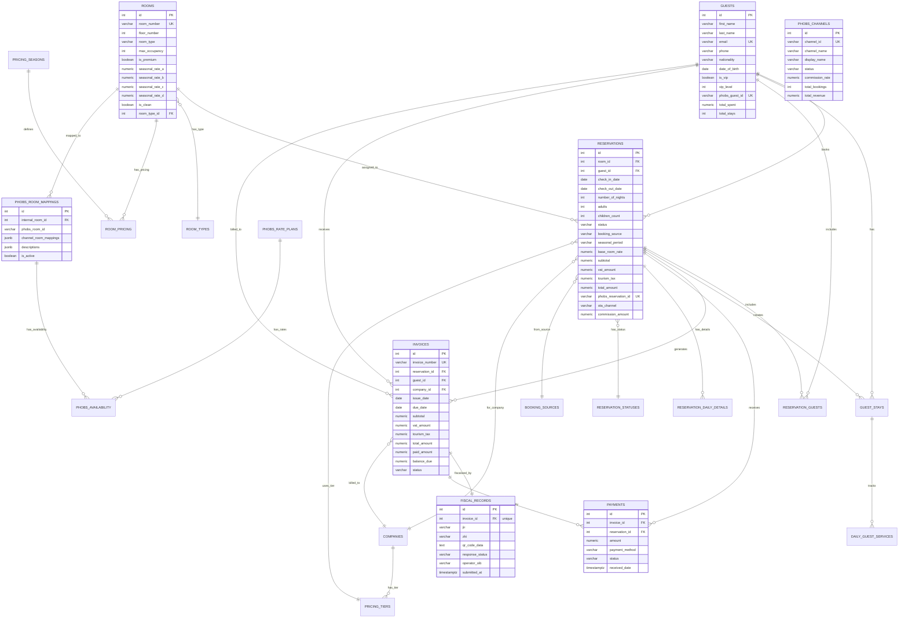

## Overview

The system uses PostgreSQL via Supabase with comprehensive schema for hotel operations, financial management, and Croatian fiscal compliance.

## Core Tables

### Guests

```sql
CREATE TABLE guests (
  id SERIAL PRIMARY KEY,
  first_name TEXT NOT NULL,
  last_name TEXT NOT NULL,
  email TEXT NOT NULL,
  phone TEXT,
  nationality TEXT,
  preferred_language TEXT DEFAULT 'en',
  is_vip BOOLEAN DEFAULT false,
  vip_level INTEGER DEFAULT 0,
  total_stays INTEGER DEFAULT 0,
  created_at TIMESTAMP DEFAULT NOW(),
  updated_at TIMESTAMP DEFAULT NOW()
);

CREATE INDEX idx_guests_email ON guests(email);
CREATE INDEX idx_guests_vip ON guests(is_vip) WHERE is_vip = true;
```

### Rooms

```sql
CREATE TABLE rooms (
  id SERIAL PRIMARY KEY,
  number TEXT NOT NULL UNIQUE,
  floor INTEGER NOT NULL,
  type TEXT NOT NULL,  -- 'single', 'double', 'deluxe', 'family', 'suite'
  base_rate NUMERIC(10,2) NOT NULL,
  max_occupancy INTEGER NOT NULL,
  status TEXT DEFAULT 'available',  -- 'available', 'occupied', 'maintenance'
  created_at TIMESTAMP DEFAULT NOW()
);

CREATE INDEX idx_rooms_floor ON rooms(floor);
CREATE INDEX idx_rooms_type ON rooms(type);
CREATE INDEX idx_rooms_status ON rooms(status);
```

### Reservations

```sql
CREATE TABLE reservations (
  id SERIAL PRIMARY KEY,
  room_id INTEGER REFERENCES rooms(id),
  guest_id INTEGER REFERENCES guests(id),

  -- Dates
  check_in_date DATE NOT NULL,
  check_out_date DATE NOT NULL,
  number_of_nights INTEGER NOT NULL,

  -- Guests
  adults INTEGER NOT NULL,
  children_count INTEGER DEFAULT 0,

  -- Status
  status TEXT NOT NULL,  -- 'confirmed', 'checked-in', 'checked-out', 'cancelled'
  booking_source TEXT,   -- 'direct', 'booking-com', 'expedia', etc.

  -- Pricing
  seasonal_period TEXT,  -- 'standard', 'high', 'peak'
  base_room_rate NUMERIC(10,2),
  subtotal NUMERIC(10,2),
  vat_amount NUMERIC(10,2),
  tourism_tax NUMERIC(10,2),
  pet_fee NUMERIC(10,2) DEFAULT 0,
  parking_fee NUMERIC(10,2) DEFAULT 0,
  additional_charges NUMERIC(10,2) DEFAULT 0,
  total_amount NUMERIC(10,2) NOT NULL,

  -- Metadata
  special_requests TEXT,
  created_at TIMESTAMP DEFAULT NOW(),
  updated_at TIMESTAMP DEFAULT NOW(),

  CONSTRAINT valid_dates CHECK (check_out_date > check_in_date),
  CONSTRAINT positive_nights CHECK (number_of_nights > 0),
  CONSTRAINT positive_guests CHECK (adults > 0)
);

CREATE INDEX idx_reservations_dates ON reservations(check_in_date, check_out_date);
CREATE INDEX idx_reservations_room ON reservations(room_id);
CREATE INDEX idx_reservations_guest ON reservations(guest_id);
CREATE INDEX idx_reservations_status ON reservations(status);
```

## Financial Tables

### Invoices

```sql
CREATE TABLE invoices (
  id SERIAL PRIMARY KEY,
  invoice_number TEXT NOT NULL UNIQUE,  -- HP-YYYY-NNNNNN
  reservation_id INTEGER REFERENCES reservations(id),
  guest_id INTEGER REFERENCES guests(id),
  company_id INTEGER REFERENCES companies(id),

  -- Dates
  issue_date DATE NOT NULL,
  due_date DATE,

  -- Financial
  subtotal NUMERIC(10,2),
  vat_amount NUMERIC(10,2),
  tourism_tax NUMERIC(10,2),
  total_amount NUMERIC(10,2) NOT NULL,
  paid_amount NUMERIC(10,2) DEFAULT 0,

  -- Status
  status TEXT NOT NULL,  -- 'draft', 'sent', 'paid', 'overdue', 'cancelled'

  -- Croatian Fiscal Compliance
  fiscal_data JSONB,  -- { oib, jir, zki, qrCodeData }

  -- Metadata
  created_at TIMESTAMP DEFAULT NOW(),
  updated_at TIMESTAMP DEFAULT NOW(),

  CONSTRAINT billing_target CHECK (
    guest_id IS NOT NULL OR company_id IS NOT NULL
  )
);

CREATE INDEX idx_invoices_number ON invoices(invoice_number);
CREATE INDEX idx_invoices_reservation ON invoices(reservation_id);
CREATE INDEX idx_invoices_status ON invoices(status);
CREATE INDEX idx_invoices_fiscal_jir ON invoices((fiscal_data->>'jir'));
```

### Fiscal Records

```sql
CREATE TABLE fiscal_records (
  id SERIAL PRIMARY KEY,
  invoice_id INTEGER REFERENCES invoices(id) ON DELETE CASCADE,

  -- Croatian Fiscal Codes
  jir TEXT NOT NULL,              -- Jedinstveni Identifikator Računa
  zki TEXT NOT NULL,              -- Zaštitni Kod Izdavatelja
  qr_code_data TEXT,              -- QR verification URL

  created_at TIMESTAMP DEFAULT NOW(),

  UNIQUE(invoice_id)
);

CREATE INDEX idx_fiscal_records_invoice ON fiscal_records(invoice_id);
CREATE INDEX idx_fiscal_records_jir ON fiscal_records(jir);
```

### Payments

```sql
CREATE TABLE payments (
  id SERIAL PRIMARY KEY,
  invoice_id INTEGER REFERENCES invoices(id),

  -- Payment Details
  amount NUMERIC(10,2) NOT NULL,
  payment_method TEXT NOT NULL,  -- 'cash', 'card', 'bank_transfer', etc.
  payment_date DATE NOT NULL,
  reference_number TEXT,

  -- Status
  status TEXT DEFAULT 'completed',  -- 'pending', 'completed', 'failed', 'refunded'

  created_at TIMESTAMP DEFAULT NOW(),

  CONSTRAINT positive_amount CHECK (amount > 0)
);

CREATE INDEX idx_payments_invoice ON payments(invoice_id);
CREATE INDEX idx_payments_date ON payments(payment_date);
```

## Corporate Tables

### Companies

```sql
CREATE TABLE companies (
  id SERIAL PRIMARY KEY,
  name TEXT NOT NULL,
  tax_id TEXT,  -- OIB for Croatian companies

  -- Contact
  email TEXT,
  phone TEXT,
  website TEXT,

  -- Address
  address TEXT,
  city TEXT,
  postal_code TEXT,
  country TEXT,

  -- Status
  is_active BOOLEAN DEFAULT true,

  created_at TIMESTAMP DEFAULT NOW(),
  updated_at TIMESTAMP DEFAULT NOW()
);

CREATE INDEX idx_companies_active ON companies(is_active) WHERE is_active = true;
```

### Pricing Tiers

```sql
CREATE TABLE pricing_tiers (
  id SERIAL PRIMARY KEY,
  company_id INTEGER REFERENCES companies(id),

  -- Tier Details
  name TEXT NOT NULL,
  discount_percentage NUMERIC(5,2),

  -- Room Type Rates
  single_rate NUMERIC(10,2),
  double_rate NUMERIC(10,2),
  deluxe_rate NUMERIC(10,2),
  family_rate NUMERIC(10,2),
  suite_rate NUMERIC(10,2),

  -- Contract
  valid_from DATE,
  valid_until DATE,
  is_active BOOLEAN DEFAULT true,

  created_at TIMESTAMP DEFAULT NOW()
);

CREATE INDEX idx_pricing_tiers_company ON pricing_tiers(company_id);
CREATE INDEX idx_pricing_tiers_active ON pricing_tiers(is_active) WHERE is_active = true;
```

## Relationships

<Accordion title="📊 Database Relationships Diagram (Click to Expand)" icon="diagram-project" defaultOpen={true}>

<Note>
  **💡 View Full-Screen:** [Click here to open this diagram in Mermaid Live Editor](https://mermaid.live/edit#pako:eJy9WFtvozgU_isIaVa70vQP9I2mtI3aXBTSSpVGsg7GTTwFmzEmanr573vMLYaYJvuyeZgpPhefy3cu8OFTmTD_0mfqmsNGQfZLePj78cObSMW8O6lZ6i1ypkBzKYqaevsYRuvI-_y8uJAf3iqMwtVTsJ4u5pF36cVSvjr5qicSrYNnw7aFU8pIQ7n0uKBpmTCnwHT-tJhOQsOmGGV8Z9hqxtViMRuzEoqCbwRLiJY285e8uPj8rB7I-nkZNpYSvc-ZS6nhW66mk-n8tuHMFadcbBzMy7vFVUQqkVmwXKKI0Z5BnjdmNDK2oedHxSXWjzhVDPR37FYoN0yYlH_HvQyeZ-F83Q_8OQ5cB9OHZ3IdrvH_Nr4J08BTl4I2I5YCdGj9GHW5KTTo8hvRq8XiHoNNosXjqvbuRcmMFLJUlI2LTRazZTCf1gJSESqzHMR-XKDBAVlPw5URKguGwOFMtZnForrhAgTlkNYnXcRNmFDFzTSaBA9kFU4Wq-vqYl5QSPk7IiTeO2T6eciBO_ga8zrcxDxNLeAP-Wy_LdbOhduSFdqLmNpx2ivJBmiNWXWWGwLGqgGWVkBfC0sdtplcGqh5f3lLu3YOdrSODuJb1WUVXsPeUqMwiGzg9Ss0YS9csN79WxACe9wMBGyY8v5ebmVc_NModZRsr5qDJ3QzuJo-TNfPjUmwQyQDRo7rfU9LsA7J8iGYn1bRVF5n4z3be2uIU1Z411Wh9BrhR_1kflxojyfe8v5wtANFt6AQSarQREDGjmkpjJJYhtd5jw6F-VYKh4CoBgUcvDe_xOTX_EPkC4m50tsDDedFykB4vCA7nvd9wQOSsh1LndfHBdkYMBJ02bZQlBlDJHlaakhJkTOh-2obgoZ9g9-v_sg4L6JKYhfBu2JEjX29EXlJJbaMmjgieRgprVAGb0RSWmKboXtngHLFMl5mx64WDAoT9Qo6BE4xxKcY6CmGxGkfNX_0nep8NVm6uR_G2-6j34e9U2bpac87GNiECnR0y-gr4YKYJydNlnpANBrr1Bm4Cr7Z6qJPhaRMh2d0y9NEMYGDorQB1ybdHlP2udmXsOn15lFPro07LmFcJseJiaFgpIqM6rnRJa6MK8AfU3agCWR9cw_FUypeYOrgbayyhqL90lSswBlRdYNhgbaMqIXQuv8e34HzNuO4paG4fVEHnW5unVetXOwkDqyxgh1YexbAqqzXW4ETe2h9yVzAS46O__dctdRqZRgjxpBiK0JbSxcuLTx3SRksMKcruk1LFT_vl18K_gdv84_v-80dnfT9lR8ONXvT3h-zqSVVfOGYH9Oc42sMI2PVKKtXHezdkltNUvMM8w9Zrt9NijKuNa5FMIRkt4r9R7_PhmKbmNHKg32G045kTG_tVjHWg2y_miU-sZB5cKzaVCZ3wXwePpxbcU1ljxV_S3bvHQkv8hT2I9ShH46eoY5ael0ITbt1CNd0heuGKN0B6C-C5yRZM1WNTMfcGnTLmuNA_o1NP-6CVJHNq2Lf9JoJ3wGp4rn1gm5-1lgGqjGznUv-Tx89xsUu8S8_fL1lmfkCgKsx4FTzv376UGoZ7QX1L7Uq2U-_zA0mmg8E7SFLONbJrP58UH1F-PoXGCUUWQ) — pan, zoom, and interact with the full diagram
</Note>



</Accordion>

## Views

### Active Reservations View

```sql
CREATE VIEW active_reservations AS
SELECT
  r.*,
  g.first_name,
  g.last_name,
  g.email,
  rm.number as room_number,
  rm.type as room_type
FROM reservations r
JOIN guests g ON r.guest_id = g.id
JOIN rooms rm ON r.room_id = rm.id
WHERE r.status IN ('confirmed', 'checked-in')
  AND r.check_out_date >= CURRENT_DATE
ORDER BY r.check_in_date;
```

### Financial Summary View

```sql
CREATE VIEW financial_summary AS
SELECT
  DATE_TRUNC('month', i.issue_date) as month,
  COUNT(*) as invoice_count,
  SUM(i.total_amount) as total_revenue,
  SUM(i.paid_amount) as total_paid,
  SUM(i.total_amount - i.paid_amount) as outstanding,
  COUNT(*) FILTER (WHERE i.fiscal_data IS NOT NULL) as fiscalized_count
FROM invoices i
GROUP BY month
ORDER BY month DESC;
```

## Functions

### Check Room Availability

```sql
CREATE OR REPLACE FUNCTION check_room_availability(
  p_room_id INTEGER,
  p_check_in DATE,
  p_check_out DATE
) RETURNS BOOLEAN AS $$
DECLARE
  conflict_count INTEGER;
BEGIN
  SELECT COUNT(*) INTO conflict_count
  FROM reservations
  WHERE room_id = p_room_id
    AND status NOT IN ('cancelled', 'checked-out')
    AND (
      (check_in_date < p_check_out AND check_out_date > p_check_in)
    );

  RETURN conflict_count = 0;
END;
$$ LANGUAGE plpgsql;
```

### Generate Invoice Number

```sql
CREATE OR REPLACE FUNCTION generate_invoice_number()
RETURNS TEXT AS $$
DECLARE
  next_number INTEGER;
  year TEXT;
BEGIN
  year := EXTRACT(YEAR FROM CURRENT_DATE)::TEXT;

  SELECT COALESCE(MAX(
    CAST(SUBSTRING(invoice_number FROM '\\d+$') AS INTEGER)
  ), 0) + 1
  INTO next_number
  FROM invoices
  WHERE invoice_number LIKE 'HP-' || year || '-%';

  RETURN 'HP-' || year || '-' || LPAD(next_number::TEXT, 6, '0');
END;
$$ LANGUAGE plpgsql;
```

## Triggers

### Update Timestamps

```sql
CREATE OR REPLACE FUNCTION update_updated_at()
RETURNS TRIGGER AS $$
BEGIN
  NEW.updated_at = NOW();
  RETURN NEW;
END;
$$ LANGUAGE plpgsql;

CREATE TRIGGER reservations_updated_at
  BEFORE UPDATE ON reservations
  FOR EACH ROW
  EXECUTE FUNCTION update_updated_at();

CREATE TRIGGER guests_updated_at
  BEFORE UPDATE ON guests
  FOR EACH ROW
  EXECUTE FUNCTION update_updated_at();
```

## Row-Level Security

```sql
-- Enable RLS
ALTER TABLE reservations ENABLE ROW LEVEL SECURITY;
ALTER TABLE invoices ENABLE ROW LEVEL SECURITY;

-- Policies
CREATE POLICY "Allow authenticated read on reservations"
  ON reservations FOR SELECT
  TO authenticated
  USING (true);

CREATE POLICY "Allow authenticated insert on reservations"
  ON reservations FOR INSERT
  TO authenticated
  WITH CHECK (true);
```

---

**Database**: PostgreSQL 15+
**Provider**: Supabase
**Total Tables**: 10+
**Real-time**: Enabled on all tables
